# Frontend-Route — 화면·라우트·흐름 정의서

[요구사항정의서.md](요구사항정의서.md) 가 **무엇을 만드는가**라면, 이 문서는 **그것이 어느 주소에, 어떤 순서로 나타나는가**를 적는다.
기능을 하나 정의할 때마다 이 문서에 라우트·네비게이션·흐름을 같이 추가한다.

- **읽는 사람**: 프론트엔드 개발자(라우터·컴포넌트 배치), 디자인팀(화면이 몇 개이고 어떻게 이어지는지)
- **현재 구현**: `univ_us_local/frontend` (Next.js 16 App Router · Tailwind 4 · FullCalendar 7), 백엔드 FastAPI 가 `frontend/out` 을 같은 origin 에서 서빙
- **용어**: 헤더·콜아웃·필 버튼·탭·칩·모달·토스트 등은 `Frontend-Figma.md` 1-3절 이름을 쓴다
- **그릴 목록·우선순위**: [Frontend-Screens.md](Frontend-Screens.md) — 화면 29개의 우선순위와 공용 부품

---

## 1. 기술 전제 (라우팅에 영향을 주는 것)

| 전제 | 결과 |
|---|---|
| **Next.js App Router + `output: "export"`** (정적 export) | 서버 컴포넌트에서 데이터를 못 가져온다. 모든 데이터는 **클라이언트에서 `/api` 호출**로 받는다 |
| **동적 라우트(`[id]`) 사용 불가**에 가깝다 | export 시 `generateStaticParams` 로 미리 만들 수 있는 경로만 나온다. 학사 일정 id 는 수집할 때마다 달라지므로 **상세는 동적 라우트가 아니라 쿼리 파라미터 + 모달**로 연다 |
| FastAPI 가 `out/` 을 정적 서빙 (`StaticFiles(html=True)`) | `/academic` 을 주소창에 직접 쳐도 열리려면 `out/academic/index.html` 이 있어야 한다 → **`next.config.ts` 에 `trailingSlash: true` 를 켠다**(또는 백엔드에 `.html` 폴백 추가). ⏳ 첫 라우트 추가 때 빌드로 확인할 것 |
| 로컬 단일 사용자 | 로그인·인증 라우트가 없다. 라우트 가드는 "프로필 입력 여부" 정도의 안내 배너뿐 |
| **`/team`·`/programs` 만 서버를 쓴다**(전역 결정 G5) | 이 두 화면만 인터넷이 필요하다. 서버가 죽어도 **나머지 화면은 그대로 동작해야 한다** — 실패를 그 화면 안에 가둔다 |
| 오프라인 아님, 항상 localhost | 라우트 전환은 즉시. 로딩 스피너보다 **스켈레톤·이전 데이터 유지**를 우선한다 |

---

## 2. 라우트 맵

### 2-1. 전체 (F16 시점)

| 경로 | 파일 | 화면 | 상태 | 기능 |
|---|---|---|---|---|
| `/` | `app/page.tsx` | **대시보드** — 커버 + 3단(액션 패널 / 캘린더 / 할 일) + 기능 섹션 | 구현됨, C1·F1·F2·F3 로 수정 | **C1**·F1·F2·F3·F6·F7·F10 |
| `/academic` | `app/academic/page.tsx` | **학사일정** — 학기 전체 일정표, 탭 4개 | **신규 (F1)** | F1 |
| `/graduation` | `app/graduation/page.tsx` | **졸업요건** — 요약 / 이수 과목 / 가정 계산 탭 | **신규 (F2)** | F2 |
| `/attendance` | `app/attendance/page.tsx` | **출결** — 과목별 현황 / 이번 주 / 시간표 설정 탭 | **신규 (F3)** | F3 |
| `/courses` · `/courses?course=<id>` | `app/courses/page.tsx` | **강의자료** — 자료 / 요약 / 문제 / 질문 탭 | **신규 (F4)** | F4·F5 |
| `/exams` | `app/exams/page.tsx` | **시험** — 시험 목록 + 계획 옵션/미리보기/진도 | **신규 (F5)** | F5 |
| `/chat` | `app/chat/page.tsx` | **대화 전체 화면** — 날짜별 내역 (대화 입력은 대시보드에도) | **신규 (F9)** | F9 |
| `/briefing` | `app/briefing/page.tsx` | **브리핑** — 지난 30일 목록 + 본문 (오늘 것은 대시보드 카드) | **신규 (F10)** | F10 |
| `/opportunities` | `app/opportunities/page.tsx` | **기회** — 장학 / 대외활동 / 사업단 / 이력 탭 + 관심사 설정 | **신규 (F11·F12·F13)** | F11·F12·F13 |
| `/team` | `app/team/page.tsx` | **팀플** — 일정 조율 / 할 일 / 팀원 탭 (**서버 필요**) | **신규 (F16)** | F16 |
| `/assignments` | `app/assignments/page.tsx` | **E클래스 › 과제·동영상** — 진행 중/완료/지난 마감 탭 + **우선순위 그룹** | **신규 (F6·F7)** | F6·F7 |
| `/eclass/posts` | `app/eclass/posts/page.tsx` | **E클래스 › 공지·자료** — 새로 올라온 공지·자료실 글·강의자료 (2026-10-03) | **신규 (F6)** | F6 |
| `/onboarding` | `app/onboarding/page.tsx` | **첫 설정** — 학과·입학년도·이수유형·가져오기 3단계 | **신규 (C2)** | C2 |
| `/settings/profile` | `app/settings/profile/page.tsx` | **내 프로필** — 소속·입학년도·성적·장학용 정보 | **신규 (C2)** | **C2**·F1·F2·F11 |
| `/settings/sources` | `app/settings/sources/page.tsx` | **수집 원천** — 원천별 상태·주기·지금 수집 | **신규 (F1)** | F1·F2·F6·F11~F13 |
| `/settings/requirements` | `app/settings/requirements/page.tsx` | **졸업요건 기준** — 룰셋 보기·수정, 교과구분 매핑 | **신규 (F2)** | F2 |
| `/settings/availability` | `app/settings/availability/page.tsx` | **가용 시간** — 낮(공강 배치 F8): 범위·공부 채우기·점심·주말·여유·블록 길이·기간 / 저녁(시험 공부 계획 F5): 저녁 시간대. 하루 상한 없음 (2026-10-07) | **신규 (F8)** | F8·F5 |
| `/settings/notifications` | `app/settings/notifications/page.tsx` | **알림·브리핑** — 브리핑 시각·보관, 알림 기본 시각·시점 | **신규 (F10)** | F10·F1·F6 |

### 2-2. 앞으로 늘어날 자리 (예약만 해 둠 — 지금 만들지 않는다)

| 경로 | 화면 | 기능 |
|---|---|---|
| `/programs` | 사업단 프로젝트 플랫폼 (멘토·과제·보고서·승인) — **⏸ 추후 구현**, 서버 필요 | F17 |

> **규칙**: 기능별 최상위 명사 1개를 라우트로 쓰고, 그 안의 상세는 쿼리 파라미터로 연다. 라우트를 깊게 파지 않는다(`/academic/2026-2/detail/...` 같은 경로 금지).

---

## 3. 네비게이션 구조 — **대시보드가 허브**

**상단 가로 메뉴(GNB)를 두지 않는다.** 기능이 8개를 넘어가면 한 줄에 담을 수 없고, 억지로 접어 두면 자주 쓰는 기능이 `더보기` 안에 숨는다. 대신 **대시보드 자체가 기능 목록**이고, 헤더에는 어디서나 필요한 것만 남긴다.

```
헤더(고정, 높이 64)
┌───────────────────────────────────────────────────────────────────────────┐
│ 유니버스                                    [🔔3]  [+ 일정 추가]  [⚙]      │
└───────────────────────────────────────────────────────────────────────────┘

/ 대시보드 = 허브
┌ 커버 ─────────────────────────────────────────────────────────────────────┐
│                          Univ-Us Planner                                  │
└───────────────────────────────────────────────────────────────────────────┘
┌ 액션 패널 ──────┐┌ 캘린더 ──────────────────┐┌ 할 일 ──────┐
│ 일정·할 일 등록  ││                          ││ To Do       │
│ 빠른 실행        ││      (C1 캘린더)         ││             │
│ 무엇이든 물어보기 ││                          ││             │
└─────────────────┘└──────────────────────────┘└─────────────┘
┌ 기능 섹션 = 진입 타일 ────────────────────────────────────────────────────┐
│ 🏛 학사일정 3건  🎓 졸업까지 32학점  ✅ 출결 위험 1과목  📚 강의자료 12    │
│ 🎯 시험 D-10     📌 과제 5건         🔥 먼저 할 것 3건   ☀ 오늘의 브리핑   │
└───────────────────────────────────────────────────────────────────────────┘
```

| 요소 | 동작 | 비고 |
|---|---|---|
| 로고 "유니버스" | → `/` | **어디서든 홈으로 돌아오는 유일한 고정 링크** |
| 🔔 알림 | 팝오버 (라우트 이동 없음) | 안 읽은 수 배지. F1-S10 |
| `+ 일정 추가` | `/?new=event` | 어느 화면에서 눌러도 대시보드로 가서 모달을 연다 |
| ⚙ 설정 | 드롭다운 → `내 프로필` / `수집 원천` / `졸업요건 기준` / `가용 시간` / `알림` | 설정 허브 페이지는 만들지 않는다 |
| **기능 타일** | 대시보드 기능 섹션 → 각 기능 페이지 | **숫자가 살아 있는 타일**이다. 단순 링크가 아니라 현재 상태를 보여 준다 |

### 3-1. 기능 페이지에서 다른 기능으로

허브 구조의 약점은 "깊은 페이지에서 옆 기능으로 못 간다"는 것이다. 세 가지로 메운다.

| 수단 | 내용 |
|---|---|
| **되돌아가기** | 모든 기능 페이지 제목 왼쪽에 `← 대시보드`. 브라우저 뒤로가기와 별개로 항상 홈으로 |
| **문맥 링크** | 기능끼리 직접 잇는다 — 학습 블록 → 그날 볼 자료(F4), 시험 카드 → 계획(F5), 과제 → 캘린더, 미분류 과목 → 룰셋 설정 |
| **대화창(F9)** | `학사일정 열어줘`, `졸업요건 보여줘` 로 이동한다. 메뉴를 대신하는 빠른 이동 수단 |

### 3-2. 반응형

| 폭 | 구조 |
|---|---|
| ≥ 1280px | 헤더 + 3단 + 기능 타일 4열 |
| 768~1279px | 캘린더가 위로, 기능 타일 3열 |
| < 768px | 세로로 쌓임, 기능 타일 2열. 헤더는 로고·알림·설정만(일정 추가는 화면 우하단 떠 있는 버튼) |

> **라우트를 추가해도 헤더를 고치지 않는다.** 대신 대시보드 기능 섹션에 타일을 하나 더한다(2-1 표와 함께 갱신).

---

## 4. C1 — 서비스 캘린더 (공통 기반)

요구사항은 [요구사항정의서.md](요구사항정의서.md) C1 절. **외부 캘린더와 연동하지 않으므로**(전역 결정 G1) 캘린더는 우리가 그리는 화면이고, 라우팅도 우리가 정한다. OAuth 동의 화면·연동 설정 페이지는 **만들지 않는다**.

### 4-1. 어디에 있나

| 위치 | 내용 |
|---|---|
| `/` 가운데 컬럼 | 캘린더 본체. 폭 1023(≥1280px 기준) |
| `/academic` 등 기능 페이지 | 캘린더를 다시 그리지 않는다. 기능 페이지는 **목록**이고, 일정은 캘린더에서 본다 |
| 기능 페이지 → 캘린더 | 항목의 `캘린더에서 보기` → `/?date=2026-08&event=<id>` (해당 달로 이동 + 상세 모달) |

### 4-2. 뷰 전환과 URL

```
‣ C A L E N D A R   [전체][e클래스][내 일정][할 일][학사]      [<] 2026년 9월 [>] [오늘]  [월|주|목록|학기]
```

| 파라미터 | 값 | 기본값 | 히스토리 |
|---|---|---|---|
| `view` | `month` `week` `list` `semester` | `month` | `replace` |
| `date` | `YYYY-MM`(월·학기) / `YYYY-MM-DD`(주·목록) | 오늘 | `replace` |
| `filter` | `all` `eclass` `mine` `todo` `academic` | `all` | `replace` |

- 마지막으로 본 뷰·필터는 `localStorage` 에도 저장해 **URL 없이 `/` 로 들어와도** 보던 화면으로 복원한다(URL 파라미터가 있으면 URL 이 이긴다).
- `view=semester` 는 `date` 를 학기 키(`2026-2`)로 해석한다.
- **주 뷰에는 교시 ↔ 시각 대응표 설정**이 있다(`1교시 09:00~09:50` …). 수업(`class`) 일정은 이 표로 시각이 정해져 시간 단위 블록으로 그려진다 — F3 이 만든 회차도 여기에 얹힌다.

### 4-3. 학기 뷰의 레이아웃 전환

학기 뷰는 폭이 필요해서 **3단 레이아웃을 깬다.**

| 뷰 | 레이아웃 |
|---|---|
| 월·주·목록 | 기존 3단 (액션 패널 341 / 캘린더 1023 / 할 일 273) |
| 학기 | 좌우 패널이 접히고 캘린더가 전체 폭. 접힌 패널은 `‹ 패널 펼치기` 로 되돌린다 |

라우트 이동은 없다(같은 `/`). 되돌아오면 접힘이 풀린다.

### 4-4. 일정을 클릭하면

| 소스 (`kind`) | 이동 | 열리는 것 |
|---|---|---|
| `academic` (F1) | `/?event=ac:…` (`push`) | 학사 상세 — 근거·출처·알림 시점 |
| `deadline` (F6) | `/?event=dl:…` (`push`) | 과제 상세 — 제출 상태·설명·e클래스 링크 |
| `class` (수업) | `/?event=cl:…` (`push`) | 수업 상세 — 강의실·교수·휴강 처리 |
| `user` / 할 일 | `/?event=<숫자>` (`push`) | 편집 폼 (기존 `EventModal`) |
| `study` (F5·F8) | `/?event=st:…` (`push`) | 학습 블록 — 무엇을 공부할지·옮기기 |

**모든 상세는 같은 규칙**: `?event=` 가 붙으면 열리고, 뒤로가기·ESC 로 닫힌다. 캘린더 화면은 뒤에 그대로 남는다.

### 4-5. 새로 만들기·드래그

| 동작 | 흐름 |
|---|---|
| 빈 칸 클릭·드래그 | `/?new=event&start=…&end=…` (`push`) → 새 일정 모달. `filter=todo` 상태면 `new=todo` |
| 헤더 `+ 일정 추가` | `/?new=event` |
| 일정 드래그 이동·크기 조절 | 라우트 변화 없음. 화면을 먼저 바꾸고(낙관적) PATCH, 실패하면 원위치 + 토스트 |
| 잠긴 소스(마감·학사·수업) 드래그 | 제자리로 돌아오고 토스트 "e클래스에서 가져온 일정은 옮길 수 없습니다" |

### 4-6. 반복 일정 편집 흐름

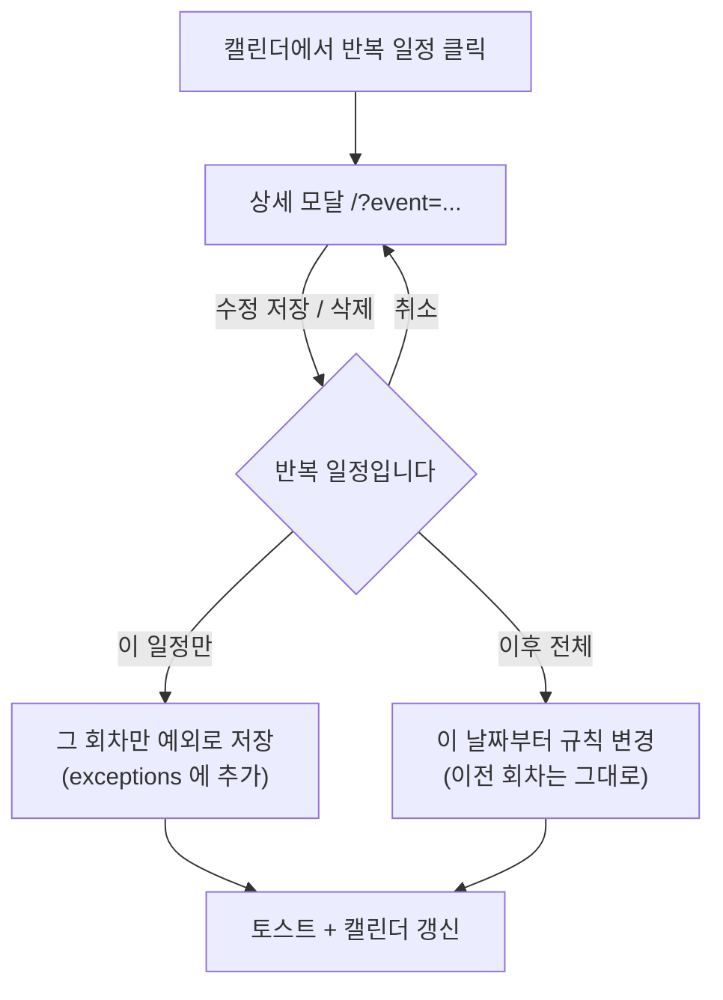

- 확인 모달은 라우트를 바꾸지 않는다(모달 위의 모달). ESC 는 확인만 닫고 상세는 남긴다.
- 수업(`class`)은 `이 일정만` 만 허용한다 — 휴강·보강 처리용.

### 4-7. 키보드

| 키 | 동작 |
|---|---|
| `T` | 오늘로 |
| `←` `→` | 이전·다음 기간 |
| `M` `W` `L` `S` | 월·주·목록·학기 뷰 |
| `N` | 새 일정 |
| `Esc` | 모달 닫기 |
| `?` | 단축키 도움말 |

입력창에 포커스가 있을 때는 단축키를 잡지 않는다.

### 4-8. 캘린더가 부르는 API

구현 (2026-09-30, `C1_Calendar_agent/calendar_core/api.py` — 요구사항정의서 C1 1절):

| 시점 | 호출 |
|---|---|
| 진입·기간 이동 | `GET /api/events?start&end` — 모든 소스가 한 번에 온다(`extendedProps.kind` 로 구분) |
| 학기 뷰 | `GET /api/events?start&end` 를 학기 범위로 |
| 만들기·수정·삭제 | `POST /api/events` · `PATCH /api/events/{id}` · `DELETE /api/events/{id}` (내 일정만) |
| 반복 | `PATCH /api/events/{id}?scope=this\|following` |
| 갱신 확인 | `GET /api/status` 의 `updated_at` 이 바뀌면 다시 부른다 |

---

## 5. C2 — 사용자 프로필·온보딩 (공통 기반)

요구사항은 [요구사항정의서.md](요구사항정의서.md) C2 절. 프로필 하나가 F1 대상 판정 · **F2 졸업요건 자동 매칭** · F11 장학 매칭을 함께 먹인다.

### 5-1. 온보딩 흐름

첫 실행(프로필 필수 4개가 비어 있음)이면 `/` 대신 `/onboarding` 으로 보낸다. 건너뛰면 다시 묻지 않고 배너로만 남긴다.

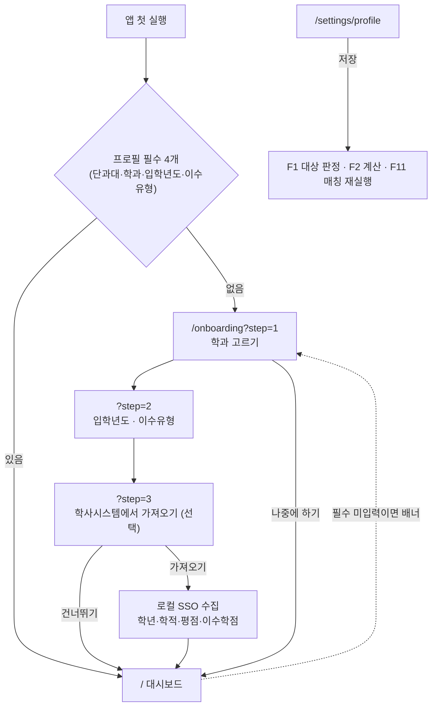

| 단계 | 화면 | 저장 |
|---|---|---|
| 1 | 단과대 → 학과 → 전공 (검색형 선택기, 마스터에서만) | 코드로 저장 (`30001229`/`30001265`/`30001267`) |
| 2 | 입학년도(연도 선택) · 이수유형(단일/복수/부전공) | 이 순간 **졸업요건 룰셋이 자동으로 붙는다** |
| 3 | `학사정보시스템에서 가져오기` — 학년·학적·평점·이수학점 | 자동 채운 항목에 `자동` 칩 |

- 각 단계는 `?step=` 으로 `replace`. **뒤로가기로 이전 단계**로 갈 수 있게 단계 이동만 `push`.
- 2단계를 마치면 이미 쓸 수 있으므로 3단계는 언제든 `건너뛰기`.

### 5-2. 학과 선택기

61개 단과대 · 수백 개 학과라 드롭다운 3개로는 느리다.

| 요구 | 처리 |
|---|---|
| 검색 | 한 입력창에 `인공지능` 을 치면 `AI융합대학 › 인공지능학부 › 인공지능전공` 후보가 뜬다 |
| 계층 | 결과에 항상 `단과대 › 학과 › 전공` 경로를 보여 준다(같은 이름의 학과가 여러 단과대에 있다) |
| 전공 없음 | 전공 트랙이 없는 학과는 3단계가 생략된다 |
| 오프라인 | 마스터는 로컬 JSON(`departments.json`)이라 네트워크 없이 뜬다 |
| 갱신 | 목록 아래 `학과 목록 갱신` — 교육과정검색에서 다시 수집 |

### 5-3. `/settings/profile`

```
┌ 내 프로필 ────────────────────────────────────────────────────────────────┐
│ 기본 정보                                                                  │
│  소속   AI융합대학 › 인공지능학부 › 인공지능전공          [바꾸기]         │
│  입학   2023학년도        이수유형  단일전공                               │
│  학년   3학년 [자동]      학적      재학 [자동]                            │
│         ↳ F1 학사일정 대상 판정, F2 졸업요건 기준에 쓰입니다               │
├───────────────────────────────────────────────────────────────────────────┤
│ 성적·학점                                        [학사시스템에서 가져오기] │
│  평점 3.42/4.5 [자동]   취득학점 98 [자동]   이수학기 5 [자동]             │
├───────────────────────────────────────────────────────────────────────────┤
│ ▸ 장학 매칭용 정보 (선택)                                    ⓘ 접혀 있음   │
│    소득구간 · 거주지역 · 출신고교 지역 · 관심사 · 해당 사항                │
│    ↳ F11 장학 매칭에만 쓰이고 PC 밖으로 나가지 않습니다  [전부 지우기]     │
└───────────────────────────────────────────────────────────────────────────┘
```

| 요소 | 동작 |
|---|---|
| `바꾸기` | 학과 선택기 모달 (`?picker=dept`, `push`) |
| 입학년도·이수유형 변경 | 저장 즉시 **F2 룰셋 재매칭** → 토스트 "졸업요건 기준이 2023 인공지능전공으로 바뀌었습니다" |
| `자동` 칩 | 학사시스템에서 채운 값. 사용자가 고치면 `수정함` 칩으로 바뀐다 |
| 민감 구역 | 기본 접힘. 펼치면 쓰는 이유 안내 + `전부 지우기` |
| 저장 | `router.back()` — 배너에서 왔으면 그 화면으로 돌아간다 |

### 5-4. 프로필이 바뀌면 (데이터 무효화)

한 곳을 고치면 세 화면이 같이 움직인다. **프론트는 프로필 저장 성공 시 아래를 다시 부른다.**

| 바뀐 값 | 다시 부를 것 |
|---|---|
| 학년·학적·소속 | `GET /api/academic/events` (F1 대상 판정) · `GET /api/scholarship/matches`(F11, 나중) |
| 학과·전공·입학년도·이수유형 | `GET /api/graduation/ruleset` + `GET /api/graduation/status` (F2) |
| 평점·취득학점 | F2 상태 · F11 매칭 |
| 민감 정보 | F11 매칭만 |

### 5-5. 라우트·파라미터

| 경로 | 화면 |
|---|---|
| `/onboarding` | 첫 설정 3단계 |
| `/settings/profile` | 프로필 보기·수정 |

| 파라미터 | 쓰는 곳 | 값 | 히스토리 |
|---|---|---|---|
| `step` | `/onboarding` | `1` `2` `3` | `push`(단계 이동) |
| `picker` | `/settings/profile` | `dept` — 학과 선택기 모달 | `push` |

### 5-6. API

| 시점 | 호출 |
|---|---|
| 프로필 읽기·저장 | `GET /api/profile` · `PATCH /api/profile` (구현 2026-09-28: 항목마다 바로 저장하므로 PUT 대신 PATCH, `null` = 지움) · `DELETE /api/profile` · `DELETE /api/profile/sensitive` |
| 학과 마스터 | `GET /api/master/departments` (로컬 JSON) · `POST /api/master/departments/sync` (교육과정검색 재수집) · `GET /api/master/status` |
| 학사시스템 가져오기 | `POST /api/profile/import` `{interactive}` (로컬 SSO) → `GET /api/profile/import` 로 진행 확인. 로그인 기록 없으면 `409 + {needLogin:true}` → '로그인 창 열기'는 `interactive:true` |
| 룰셋 매칭 확인 | `GET /api/graduation/ruleset?dept&year&track` — 매칭 결과와 `matchLevel`(정확/학부공통/인접연도/없음) |

### 5-7. 로딩·빈·에러

| 상황 | 화면 |
|---|---|
| 마스터 없음(첫 실행) | "학과 목록을 내려받는 중" 스켈레톤 → 실패 시 `다시 시도` + 수기 입력 허용 |
| SSO 세션 만료 | "학사정보시스템 로그인이 필요합니다" 모달 → 로컬 로그인 창 |
| 룰셋 인접 연도로 매칭 | 프로필 저장 후 토스트로 ⚠️ 경고 + `/graduation` 상단 배너 |
| 룰셋 없음 | "이 학과·입학년도 기준이 아직 없습니다 — 직접 입력하면 바로 계산됩니다" + `/settings/requirements` 링크 |
| 필수 미입력 | `/academic`·`/graduation` 상단 배너 → `/onboarding?step=1` |

---

## 6. F1 — 학사 일정 자동 등록·알림

요구사항은 [요구사항정의서.md](요구사항정의서.md) F1 절. 여기서는 화면과 이동만 다룬다.

### 6-1. 화면 흐름도

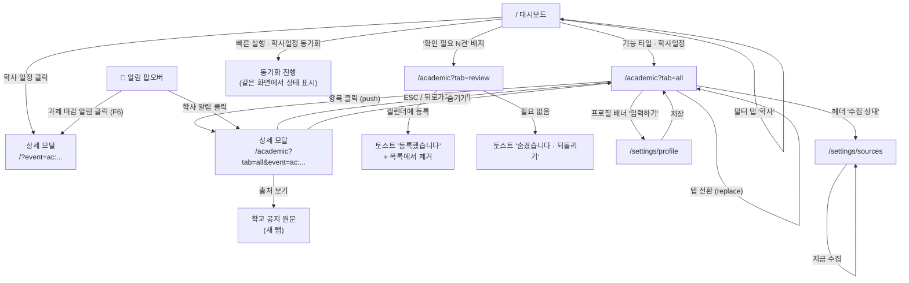

### 6-2. `/` 대시보드 — F1 으로 바뀌는 부분

기존 3단 레이아웃(액션 패널 341 / 캘린더 1023 / 할 일 273)은 그대로 두고 **안에 얹기만** 한다.

```
┌ 커버 ─────────────────────────────────────────────────────────────────────┐
│                          Univ-Us Planner                                  │
└───────────────────────────────────────────────────────────────────────────┘

┌ 왼쪽 ActionPanel ─────┐ ┌ 가운데 Calendar ────────────┐ ┌ 오른쪽 TodoList ─┐
│ 📝 일정, 할 일 등록    │ │ ‣ C A L E N D A R           │ │ ‣ T O  D O       │
│  [일정 추가][할 일]    │ │ [전체][e클래스][내 일정]     │ │  (그대로)        │
│                       │ │ [할 일][학사] ← 신규 탭      │ │                  │
│ ⚡ 빠른 실행           │ │                             │ │                  │
│  [e클래스 동기화]      │ │  ┌─────┬─────┬─────┐        │ │                  │
│  [학사일정 동기화] ←신규│ │  │ 1   │ 2   │ 3   │        │ │                  │
│   3분 전 · 12건        │ │  │💳등록금 납부 ──────▶      │ │                  │
│                       │ │  └─────┴─────┴─────┘        │ │                  │
│ ⚠ 확인 필요 3건 ← 신규 │ │                             │ │                  │
│   [확인하러 가기]      │ │                             │ │                  │
└───────────────────────┘ └─────────────────────────────┘ └──────────────────┘
```

| 구역 | 변경 | 라우트 동작 |
|---|---|---|
| 캘린더 필터 탭 | `학사` 탭 추가 (`전체 / e클래스 / 내 일정 / 할 일 / 학사`) | 선택 상태를 `/?filter=academic` 로 URL 에 반영(`replace`). 새로고침·공유해도 같은 화면 |
| 캘린더 이벤트 | 학사 일정은 **`학사` 탭에서만** 그린다(2026-09-30 — 전체 탭에서 뺌). 유형별 색 + 아이콘, 기간형은 가로 막대, `appliesToMe=false` 는 표시하지 않음. **두 주가 넘는 신청 기간은 '시작'·'마감' 두 점**(구현 2026-09-28 — 막대가 모든 주를 덮지 않게, id `…#start`·`…#end`, `extendedProps.refId` 로 상세) | 클릭 → `/?event=<id>` (`push`) → 상세 모달 → `내 일정에 넣기` |
| 내 일정에 넣기 (2026-09-30) | 학사 상세의 주 버튼. 누르면 같은 자리에서 **내 일정 폼**(제목 '내 일정에 넣기')이 제목·날짜·시각·분류 학업·메모(원래 기간·출처)를 채워 열린다. 두 주 넘는 기간은 `○○ 마감` 하루로. 저장하면 상세로 돌아와 `✓ 내 일정에 있음` + `내 일정 보기`. 만든 일정은 `origin='ac:…'` 로 이어져 전체 탭에 보이고, 그 상세에 `학사 일정에서 가져옴` 링크 | `/academic` 목록 행의 ＋ 버튼은 `?event=<id>&add=1` (`push`) — 폼부터 열리고 닫으면 상세 없이 닫힌다 |
| 빠른 실행 콜아웃 | `학사일정 동기화` 필 버튼 + 마지막 수집 시각·건수 | 같은 화면에서 진행 표시. 실패하면 줄 아래 빨강 한 줄 + `/settings/sources` 링크 |
| 새 콜아웃 | `⚠ 신규 일정 N건 · 확인 필요 M건` + 한 줄 설명(`26분 전 수집에서 새로 찾은 학사일정`). **상자 크기는 예전 그대로**(두 줄, 넘치면 말줄임 + 툴팁). 0 인 쪽은 빼고, 둘 다 0 이면 숨김. 확인 필요가 없으면 경고색 대신 기본색. 수집 중에는 신규를 세지 않는다 | `신규 일정` → `/academic`(목록에 '신규' 칩), `확인 필요` → `/academic?tab=review` (`push`) |

### 6-3. `/academic` 학사일정 페이지 (신규)

```
헤더
┌ 페이지 제목 ──────────────────────────────────────────────────────────────┐
│ 🏛 학사일정              [2026-2학기 ▾]        수집: 3분 전 · 12건  [동기화] │
├───────────────────────────────────────────────────────────────────────────┤
│ ℹ 학년·소속을 입력하면 나에게 해당하는 일정만 골라 드립니다   [입력하기]      │  ← 프로필 없을 때만
├───────────────────────────────────────────────────────────────────────────┤
│ [전체 24] [내 해당 18] [확인 필요 3] [숨김 2]                               │  ← 탭
├───────────────────────────────────────────────────────────────────────────┤
│ 2026년 8월 ───────────────────────────────────────────────────────────    │
│  💳 등록금 납부 기간          8/24(월)~8/28(금)   D-3  [내 해당]  학사일정   │
│  📝 수강신청                  8/5(화) 10:00       지남           학사공지   │
│ 2026년 9월 ───────────────────────────────────────────────────────────    │
│  📅 개강                      9/1(월)             D+24          학사일정    │
│  🏛 휴·복학 신청 기간         9/1~9/5             [해당 없음]△   공과대학    │
└───────────────────────────────────────────────────────────────────────────┘
```

| 요소 | 내용 | 라우트/상태 |
|---|---|---|
| 학기 선택 | `2026-2` 기본 = 오늘이 속한 학기 | `/academic?semester=2026-2` (`replace`) |
| 탭 | 전체 / 내 해당 / 확인 필요(N) / 숨김 | `/academic?tab=all\|mine\|review\|hidden` (`replace`) — 뒤로가기로 탭이 되감기지 않게 |
| 목록 행 | 아이콘 · 제목 · 기간 · D-day 칩 · 상태 칩 · 출처 | 클릭 → `?event=<id>` 추가 (`push`) |
| 행 상태 | 지난 항목 불투명도 55%, `해당 없음` 흐리게, `변경됨` 칩 | |
| 첫 진입 스크롤 | 오늘 이후 첫 항목이 화면 상단 1/3 지점에 오도록 | `?event=` 로 딥링크 들어오면 그 항목으로 |
| 동기화 버튼 | 학사 원천만 실행 | 진행 중 비활성 + 진행 표시 |

**'확인 필요' 탭은 목록이 아니라 카드다** (승인 동작이 있으므로):

```
┌───────────────────────────────────────────────────────────────┐
│ 📝 2026학년도 2학기 수강신청                      신뢰도 0.62  │
│ 시작 [2026-08-05] 10:00   종료 [2026-08-07] 17:00   ← 고칠 수 있음
│ "수강신청은 8월 5일(화) 10:00부터 7일(목) 17:00까지" ← 원문 근거 │
│ 출처: 학사공지 · 2026-07-28  [원문 보기 ↗]                     │
│                              [캘린더에 등록]  [필요 없음]      │
└───────────────────────────────────────────────────────────────┘
```

- `캘린더에 등록` → 낙관적 업데이트로 카드 제거 + 토스트 "등록했습니다". 캘린더(`/`)에도 즉시 반영.
- `필요 없음` → 숨김 + 토스트 "숨겼습니다 [되돌리기]" (5초).
- 근거가 약한 항목(신뢰도 < 0.5)은 **"근거가 약한 항목 4건 ▾"** 로 접어서 목록 맨 아래.

### 6-4. 상세 모달 (라우트 공유)

`/` 와 `/academic` **둘 다에서 같은 컴포넌트**를 쓴다. 현재 경로에 `?event=<id>` 가 붙으면 열리고, 빼면 닫힌다.

```
┌ 모달 (최대 폭 540) ───────────────────────────────┐
│ 💳 등록금 납부 기간                          [×]   │
│ 2026. 8. 24.(월) ~ 8. 28.(금)   ~~8/26 까지~~ 변경됨│
│ ───────────────────────────────────────────────── │
│ 대상   재학생 전체              [내 해당]          │
│ 유형   등록·납부                신뢰도 0.93        │
│ 근거   "납부기간: 2026. 8. 24.(월) ~ 8. 28.(금)"   │
│ 출처   전남대 학사일정 ↗ / 학사공지(8/1) ↗         │
│ ───────────────────────────────────────────────── │
│ 알림   [✓] D-7  [✓] D-3  [✓] D-1  [ ] 시작 30분 전 │
│ 메모   [                                        ]  │
│ ───────────────────────────────────────────────── │
│            [숨기기]            [납부 안내 보기 ↗]  │
└───────────────────────────────────────────────────┘
```

| 동작 | 라우터 |
|---|---|
| 열기 | `router.push('?event=' + id)` — 뒤로가기로 닫히게 하려고 `push` |
| 닫기 (× / ESC / 배경 클릭) | `router.back()`. 직접 URL 로 들어와 히스토리가 없으면 `router.replace(경로에서 event 제거)` |
| 숨기기 | PATCH 후 모달 닫고 토스트 "숨겼습니다 [되돌리기]" |
| 알림 토글·메모 | 즉시 PATCH(디바운스 500ms), 실패하면 이전 값 복구 + 토스트 |
| 출처 링크 | `target="_blank" rel="noopener noreferrer"` — 학교 사이트는 새 탭 |

### 6-5. 알림 팝오버

라우트가 아니라 헤더에 붙은 팝오버. 열림 상태는 URL 에 반영하지 않는다(일시적 UI).

```
🔔 알림 3
┌──────────────────────────────────────────┐
│ 놓친 알림 2 ─────────────────────────     │  ← PC 가 꺼져 있던 동안의 알림
│ ⏰ D-3 · 등록금 납부 기간      9/22 09:00 │
│ ⏰ D-1 · 성적 이의신청         9/24 09:00 │
│ 오늘 ─────────────────────────────────    │
│ 🔄 수강신청 날짜가 바뀌었습니다  08:10    │
│ ──────────────────────────────────────    │
│ [모두 읽음]                               │
└──────────────────────────────────────────┘
```

| 동작 | 결과 |
|---|---|
| 알림 클릭 | 읽음 처리 + 해당 항목 상세로 이동 — 학사는 `/academic?event=<id>`, 과제 마감(F6)은 `/?event=<id>` |
| 모두 읽음 | 배지 0 |
| 팝오버 밖 클릭 / ESC | 닫기 |

> **여기가 알림의 전부다.** 학생이 과제·학사 일정을 다루는 시점은 거의 PC 앞이므로 1차는 이 팝오버(+ 놓친 알림)로 대체한다.
> **모바일 알림은 추후 검토**(G2) — 푸시 권한 요청 배너, 구독 관리 화면, 기기 목록 같은 UI 는 지금 만들지 않는다. 디자인팀도 그 화면은 그리지 않아도 된다.

### 6-6. `/settings/profile` · `/settings/sources`

| 화면 | 구성 | 저장 |
|---|---|---|
| 내 프로필 | 학년(1~4·초과) · 학적(재학/휴학/졸업유예) · 단과대 · 학과 · 입학년도 | `저장` 누르면 PUT → 토스트 후 **직전 화면으로 돌아간다**(`router.back()`). F1 배너에서 왔으면 `/academic` 으로 |
| 수집 원천 (F1, 2026-09-29 개정) | '학사일정 (F1)' 섹션에 **원천 4곳 카드** — 그룹 '학교 전체'(① 학사일정 표 · ② 학사안내), '내 소속'(④ 내 학부 · ③ 내 단과대학). 카드: 아이콘 · 이름 · (③·④) 소속 칩 · 상태 배지 · 한 줄 설명 · (③·④) `호스트 › 게시판 · 말머리 '학사'만` + `자동으로 찾음 · 9/29`/`직접 지정` 칩 · 마지막 수집 · **보이는 일정 N건** · 오른쪽 **켜기 토글**, 아래 `지금 수집` · `원문 보기` · (③·④) `게시판 직접 지정`. 꺼진 카드는 점선·흐리게, 건수에 취소선 + '(꺼서 숨김)'. 문제 배너: 소속 필요 → `프로필에서 고르기`, 홈페이지 못 찾음 → `게시판 직접 지정`, 소속 바뀜 → `지금 받기` | 토글은 즉시 반영 + 토스트 `껐습니다 — 여기서만 온 일정은 목록·캘린더에서 빠집니다 [되돌리기]`. 한 번도 안 받은 원천을 켜면 바로 수집. 게시판 지정은 모달 `?board=my_dept` (push) — 주소 검증(`…/bbs/<site>/<번호>/`), `저장하고 받기` · `자동으로 되돌리기` |
| `/academic` 머리 | 목록 위 한 줄 `가져오는 곳 [학사일정 표 119] [학사안내 42] [인공지능학부 16] [AI융합대학 7] 관리` — 알약 스위치(`role=switch`), 꺼지면 점선·취소선, 문제가 있으면 ⚠ 아이콘 + 툴팁. 모두 끄면 목록 자리에 "가져오는 곳을 모두 껐습니다" | 누르면 바로 켜고 끔(설정 카드와 같은 훅 `useAcademicSources`) |

### 6-7. URL 파라미터 규약

| 파라미터 | 쓰는 곳 | 값 | 히스토리 |
|---|---|---|---|
| `view` | `/` | `month` `week` `list` `semester` (4-2 절) | `replace` |
| `filter` | `/` | `all` `eclass` `mine` `todo` `academic` | `replace` |
| `date` | `/` | `YYYY-MM` / `YYYY-MM-DD` / 학기 키 — 캘린더가 보는 기간 | `replace` |
| `event` | `/` `/academic` | 항목 id (`ac:…` `dl:…` `cl:…` `st:…` 숫자) | `push` (모달) |
| `new` | `/` | `event` `todo` — 새로 만들기 모달 | `push` |
| `tab` | `/academic` | `all` `mine` `review` `hidden` | `replace` |
| `semester` | `/academic` | `2026-2` | `replace` |
| `board` | `/settings/sources` | `my_dept` `my_college` — 게시판 직접 지정 모달 | `push` (모달) |
| `add` | `/academic` (`event` 와 함께) | `1` — 학사 일정을 '내 일정에 넣기' 폼부터 연다 | `push` (모달) |

원칙 세 가지:
1. **모달은 `push`, 필터·탭은 `replace`** — 뒤로가기는 "모달 닫기"로만 느껴지게 한다.
2. 파라미터가 없으면 기본값(`tab=all`, 이번 학기, 오늘이 있는 달)으로 동작한다. 빈 URL 도 항상 유효해야 한다.
3. 알 수 없는 값(`tab=zzz`)은 기본값으로 떨어뜨리고 에러 화면을 내지 않는다.

### 6-8. 컴포넌트 배치

```
app/
  layout.tsx                 (수정) Header · ToastProvider · NotificationProvider 추가
  page.tsx                   (유지) → Dashboard
  academic/page.tsx          (신규) → AcademicPage
  settings/profile/page.tsx  (신규)
  settings/sources/page.tsx  (신규)
components/
  Header.tsx                 (신규) 로고 · 알림 버튼 · 일정 추가 · 설정 (메뉴 링크 없음)
  NotificationPopover.tsx    (신규) F1-S10
  Dashboard.tsx              (수정) 학사 필터 탭·확인 필요 콜아웃 연결
  CalendarView.tsx           (수정) kind="academic" 렌더링·색·아이콘
  ActionPanel.tsx            (수정) 원천별 동기화 버튼(D7), 확인 필요 콜아웃
  academic/AcademicList.tsx  (신규) 월 그룹 목록
  academic/ReviewCard.tsx    (신규) 확인 필요 카드(날짜 수정 + 승인/거절)
  academic/AcademicDetail.tsx(신규) 상세 모달 본문
  academic/AcademicSources.tsx(신규) 수집 원천 4곳 카드(설정) · 알약 스위치(/academic) — F1-S12
  EventModal.tsx             (유지) 내 일정 추가·수정
  EventDetail.tsx            (수정) event 파라미터로 kind 를 보고 본문을 갈아끼움
  ui.tsx                     (수정) Chip · Badge · Banner · Toast · Popover 추가
lib/
  types.ts                   (수정) AcademicEvent · Notification · SourceStatus · Profile
  api.ts                     (수정) 아래 API 추가
  useQueryState.ts           (신규) 쿼리 파라미터 ↔ 상태 훅 (push/replace 규칙 캡슐화)
  useAcademicSources.ts      (신규) 원천 4곳 불러오기 · 켜고 끄기(되돌리기) · 게시판 지정
```

### 6-9. 화면이 부르는 API

| 화면 | 호출 | 시점 |
|---|---|---|
| `/` 캘린더 | `GET /api/events?start&end` — 학사 일정이 `extendedProps.kind="academic"` 로 **함께** 온다 | 진입 시, 달 이동 시 |
| `/` 콜아웃 | `GET /api/status` — 원천별 마지막 수집·확인 필요 건수 포함 | 진입 시 + 폴링(평소 60초 / 동기화 중 3초, 기존 규칙 유지) |
| `/` 동기화 버튼 | `POST /api/sources/{key}/sync` | 클릭 |
| `/academic` | `GET /api/academic/events?semester=&tab=` | 진입·학기 변경. 탭 전환은 **클라이언트 필터**(재요청 없음) |
| 확인 필요 승인 | `PATCH /api/academic/events/{id}` `{status:"approved", start, end}` | 클릭 (낙관적 업데이트) |
| 숨김·복원·메모·알림 | `PATCH /api/academic/events/{id}` `{hidden, memo, reminders}` | 즉시(디바운스) |
| 알림 | `GET /api/notifications?unread=1` / `POST /api/notifications/{id}/read` / `POST /api/notifications/read-all` | 팝오버 열 때 + 폴링 60초 |
| 프로필 | `GET/PUT /api/profile` | 진입·저장 |
| 원천 | `GET /api/sources` · `POST /api/sources/{key}/sync` · `PATCH /api/sources/{key}` `{enabled}` 켜고 끄기 · `{overrideUrl}` ③·④ 게시판 지정(`null` = 자동) | 진입·클릭. 켜고 끈 뒤 `/api/events`·`/api/academic/events` 를 다시 부른다 |

> 데이터가 바뀌었는지는 `GET /api/status` 의 `updated_at` 으로 판단한다. 값이 달라졌을 때만 `/api/events`·`/api/academic/events` 를 다시 부른다(불필요한 재요청 금지).

### 6-10. 로딩·빈·에러

정적 export 라 `loading.tsx` 의 서버 스트리밍을 쓸 수 없다. **컴포넌트 안에서 3가지 상태를 직접** 그린다.

| 상태 | `/` | `/academic` |
|---|---|---|
| 첫 로딩 | 캘린더 자리에 회색 스켈레톤(칸 구조만) | 목록 자리에 행 6개 스켈레톤 |
| 갱신 중 | 이전 데이터 유지 + 헤더에 얇은 진행 바 | 동일 |
| 빈 데이터 | "아직 수집한 학사일정이 없습니다" + `지금 수집하기` | 탭별 빈 문구(요구사항정의서 8절 표) |
| API 실패 | 해당 패널만 "불러오지 못했습니다 [다시 시도]" — **다른 패널은 정상 동작** | 동일 |
| 백엔드 꺼짐 | 헤더 아래 빨강 띠 "백엔드에 연결할 수 없습니다" — 앱을 트레이에서 종료하고 다시 실행 | 동일 |

### 6-11. 반응형

기존 브레이크포인트(1280 / 768)를 그대로 따른다.

| 폭 | `/` | `/academic` |
|---|---|---|
| ≥ 1280px | 3단 341 : 1023 : 273 (간격 46) | 가운데 정렬 1023, 좌우 여백 96 |
| 768~1279px | 캘린더가 위, 액션 패널·할 일이 아래 2단 | 좌우 여백 40, 목록 전체 폭 |
| < 768px | 한 줄로 쌓임 | 좌우 여백 20. 목록 행은 2줄(제목 / 기간·칩), 탭은 가로 스크롤 |
| 모달 | < 768px 에서 **바텀 시트**(아래에서 올라오고 전체 폭, 상단만 라운드 12) | 동일 |

### 6-12. 접근성·키보드

| 항목 | 규칙 |
|---|---|
| 모달 | 열릴 때 제목에 포커스, 포커스 트랩, ESC 닫기, 뒤 배경 스크롤 잠금, `role="dialog" aria-modal="true"` |
| 목록 | 행은 `<button>` 또는 `<a>` — Tab 으로 이동, Enter 로 상세 |
| 탭 | `role="tablist"` + 좌우 화살표 이동 |
| 칩·상태 | 색만으로 뜻을 전하지 않는다(`해당 없음`, `변경됨` 등 글자 병기) |
| 토스트 | `role="status"`, 5초 유지, `되돌리기` 는 Tab 으로 닿아야 함 |
| 알림 팝오버 | 버튼에 `aria-expanded`, 닫히면 트리거로 포커스 복귀 |

---

## 7. F2 — 졸업요건·학점 트래커

요구사항은 [요구사항정의서.md](요구사항정의서.md) F2 절. **읽는 화면**이라 F1 과 성격이 다르다 — 수집·승인 흐름 대신 **한 화면에서 숫자를 파고드는** 흐름이다.

### 7-1. 화면 흐름도

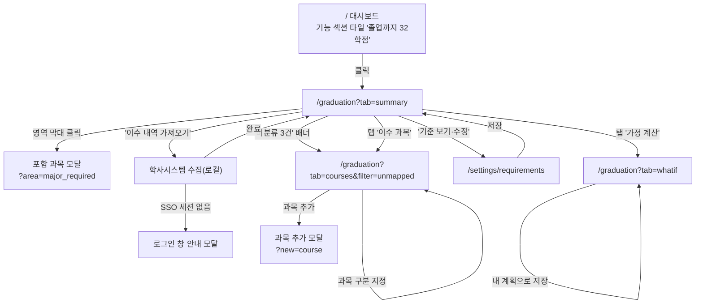

### 7-2. 라우트

| 경로 | 화면 | 비고 |
|---|---|---|
| `/graduation` | 졸업요건 트래커 | 탭 3개 |
| `/settings/requirements` | 요건 룰셋 보기·수정 | `/settings/sources` 와 같은 자리(설정) |

| 파라미터 | 값 | 기본값 | 히스토리 |
|---|---|---|---|
| `tab` | `summary` `courses` `whatif` | `summary` | `replace` |
| `area` | 영역 키(`major_required` 등) — 포함 과목 모달 | — | `push` |
| `filter` | `courses` 탭에서 `all` `unmapped` `manual` | `all` | `replace` |
| `new` | `course` — 과목 추가 모달 | — | `push` |
| `track` | `single` `double` `minor` — 이수유형 | `single` | `replace` |
| `plan` | `whatif` 탭에서 저장한 '내 계획' id — 가정 복원 (구현 2026-09-28) | — | `replace` |

`/settings/requirements` 는 `year`(입학년도, 기본 = 프로필) · `track` 을 `replace` 로, '비슷한 학과에서 복사' 모달을 `copy=1`(`push`)로 연다.

### 7-3. `/graduation` 요약 탭

```
┌ 페이지 제목 ──────────────────────────────────────────────────────────────┐
│ 🎓 졸업요건            [2023 입학 · 인공지능학부 · 단일전공 ▾]  [기준 보기] │
├───────────────────────────────────────────────────────────────────────────┤
│ ⓘ 참고용입니다. 최종 확인은 학과 사무실·학사정보시스템에서 하세요.          │  ← 항상 고정
├───────────────────────────────────────────────────────────────────────────┤
│ ⚠ 분류하지 못한 과목 3건 — 지정해야 정확해집니다        [지정하기]         │  ← 있을 때만
├───────────────────────────────────────────────────────────────────────────┤
│ [요약] [이수 과목] [가정 계산]                                             │
├───────────────────────────────────────────────────────────────────────────┤
│   ┌───────────┐   졸업까지                                                │
│   │   ◕ 76%   │   32 학점                     판정: 부족                  │
│   │  98/130   │   전공필수 2과목 · 핵심교양 3학점                          │
│   └───────────┘   평점 3.42 / 최저 1.75 ✅                                │
├───────────────────────────────────────────────────────────────────────────┤
│ 영역별                                                                     │
│  전공필수   ████████████░░░░  30/36   부족 6   (남은 과목 2) ›             │
│  전공선택   ██████████████░░  33/39   부족 6                 ›             │
│  핵심교양   ████████░░░░░░░░   9/12   부족 3                 ›             │
│  일반선택   ████████████████  26/0    충족                   ›             │
├───────────────────────────────────────────────────────────────────────────┤
│ 졸업인증                                                                   │
│  ☑ 영어인증   TOEIC 780 (2025-04)                                         │
│  ☐ 봉사 30시간                              [기록하기]                     │
│  ? 캡스톤디자인                             [확인 필요]                    │
└───────────────────────────────────────────────────────────────────────────┘
```

| 요소 | 동작 |
|---|---|
| 이수유형 선택 | `?track=` 변경 → 다른 룰셋으로 재계산 (`replace`) |
| 영역 행 `›` | `?area=<key>` (`push`) → 그 영역에 들어간 과목 목록 모달 |
| `기준 보기` | `/settings/requirements` (`push`) |
| 인증 항목 | 그 자리에서 체크·메모(즉시 PATCH). 라우트 이동 없음 |
| 고지 문구 | 스크롤해도 요약 상단에 남는다 |

### 7-4. 이수 과목 탭

학기별로 묶인 표. **구분을 고치는 곳**이자 수기 과목을 더하는 곳이다.

| 요소 | 동작 |
|---|---|
| 행의 `구분` 셀 | 드롭다운으로 영역 지정 → 즉시 PATCH → 요약 숫자 갱신(낙관적) |
| 미분류 필터 | `?filter=unmapped` — 배너에서 오면 이 상태로 열린다 |
| `과목 추가` | `?new=course` (`push`) → 모달(년도·학기·과목명·학점·구분·성적) |
| 수기 과목 | `직접 입력` 칩으로 구분 표시, 삭제 가능 |
| 자동 수집분 | 삭제 불가(제외 토글만) — 원본은 학사시스템이다 |
| `이수 내역 가져오기` | 로컬 수집 실행. 진행 중 버튼 비활성, 끝나면 토스트 |

### 7-5. 가정 계산 탭

```
┌───────────────────────────────────────────────────────────────┐
│ 가정을 넣어 보세요. 과목을 추천하지는 않습니다.                │
│  전공필수 [+ 6] 학점   ☑ 자료구조(3)  ☑ 운영체제(3)           │
│  전공선택 [+ 6] 학점                                          │
│  핵심교양 [+ 3] 학점                                          │
├───────────────────────────────────────────────────────────────┤
│              현재            →         가정 후                │
│  총 학점     98/130                    113/130                │
│  남은 학점   32                        17                     │
│  전공필수    2과목 남음                모두 충족 ✅            │
├───────────────────────────────────────────────────────────────┤
│                         [초기화]  [내 계획으로 저장]           │
└───────────────────────────────────────────────────────────────┘
```

- 입력 즉시 재계산(디바운스 200ms), **서버 왕복 없이 프론트에서 같은 규칙을 쓰지 않는다** — 계산은 항상 백엔드 `POST /api/graduation/simulate` 로 보내 **계산기 하나만** 유지한다.
- 저장하지 않으면 탭을 떠날 때 사라진다(경고 없음). 저장하면 `?plan=<id>` 로 복원.

### 7-6. `/settings/requirements`

| 요소 | 내용 |
|---|---|
| 상단 | 입학년도·학과·이수유형 선택 → 해당 룰셋 로드 |
| 본문 | 총 학점·최저 평점·영역별 최소 학점·전공필수 과목 목록·인증 항목. 값마다 **근거**(요람 쪽수·학칙 조항)를 옆에 표시 |
| 수정 | 값 입력 → 저장하면 `내 수정본`이 되고 `사용자 수정` 배지. `기본값으로 되돌리기` 버튼 |
| 룰셋 없음 | "이 학과·입학년도 기준이 아직 없습니다" + `직접 입력하기` / `비슷한 학과에서 복사` |
| 교과구분 매핑 | 학사시스템 구분 문자열 ↔ 영역 매핑표를 여기서도 고칠 수 있다 |

### 7-7. 컴포넌트·API

```
app/graduation/page.tsx            (신규) 탭 3개
app/settings/requirements/page.tsx (신규)
components/graduation/
  ProgressSummary.tsx   도넛·남은 학점·판정 배지·고지
  AreaBars.tsx          영역별 막대 + 모달 트리거
  CertificationList.tsx 인증 체크리스트
  CourseTable.tsx       학기별 이수 과목 표(구분 드롭다운)
  WhatIfPanel.tsx       가정 계산
  RulesetEditor.tsx     룰셋 보기·수정
```

| 화면 | 호출 (구현 2026-09-28 — `F2_Graduation_agent/graduation/api.py`) |
|---|---|
| 요약·이수 과목 | `GET /api/graduation/status?track=single` 하나로 판정·영역·인증·**이수 과목(계산된 영역·제외 이유)**까지 받는다. 탭 전환에 재요청 없음 |
| 과목 조작 | `POST /api/graduation/courses` · `PATCH /api/graduation/courses/{id}` `{area, applyToCategory, excluded, …}` · `DELETE`(직접 입력만) — **응답에 다시 계산한 status** 가 온다(낙관적 반영 후 교체) |
| 수집 | `POST /api/graduation/sync` `{interactive}` (로컬 SSO) → `GET /api/graduation/sync` 2초 폴링. 세션 없으면 `409 + {needLogin:true}` |
| 가정 계산 | `POST /api/graduation/simulate` `{track, assumptions:{areas, courses}}` → `{current, assumed}` · 내 계획 `GET/POST /api/graduation/plans` · `DELETE /plans/{id}` |
| 인증 | `PATCH /api/graduation/certifications/{key}` `{state, memo}` |
| 룰셋 | `GET /api/graduation/ruleset?year&track` (매칭 단계·경고·펼친 룰셋·편집용 원본, 없으면 빈 템플릿) · `PUT`(내 수정본) · `DELETE`(되돌리기) · `GET /api/graduation/rulesets[/{id}]`(복사 후보) |
| 교과구분 매핑 | `GET/PUT /api/graduation/categories` |
| 교육과정 | `GET /api/graduation/curriculum` · `POST /api/graduation/curriculum/sync` (내 학과·전공·입학년도, 공개 페이지) |
| 메인 타일 | 따로 부르지 않는다 — `GET /api/status` 의 `graduation` 칸(남은 학점·판정·한 줄·updatedAt). `updatedAt` 이 바뀌면 `/graduation` 도 다시 부른다 |

### 7-8. 로딩·빈·에러

| 상황 | 화면 |
|---|---|
| 첫 진입(데이터 없음) | "학사정보시스템에서 이수 내역을 가져오세요" + `가져오기` / `직접 입력` |
| 수집 중 | 상단 진행 바, 기존 숫자 유지 |
| SSO 세션 만료 | 모달 "학사정보시스템 로그인이 필요합니다 — 로그인 창이 열립니다" + `열기` |
| 룰셋 없음 | 요약 대신 안내 카드(6-6의 '룰셋 없음') |
| 미분류 존재 | 판정 배지를 `확인 필요`로 내리고 배너 상시 노출 |
| 계산 실패 | "계산하지 못했습니다" + `다시 시도`. 이수 과목 탭은 그대로 쓸 수 있다 |

### 7-9. 반응형

| 폭 | 요약 탭 |
|---|---|
| ≥ 1280px | 왼쪽 도넛 + 오른쪽 숫자, 영역별 막대는 전체 폭 |
| 768~1279px | 도넛과 숫자가 위아래로 |
| < 768px | 도넛 축소, 영역별은 카드 목록으로. 이수 과목 표는 **행당 2줄**(과목명 / 학기·학점·구분) |

---

## 8. F3 — 출결·학사경고 예방

요구사항은 [요구사항정의서.md](요구사항정의서.md) F3 절. **입력이 있어야 돌아가는 기능**이라, 입력을 얼마나 쉽게 만드느냐가 화면의 전부다.

### 8-1. 화면 흐름도

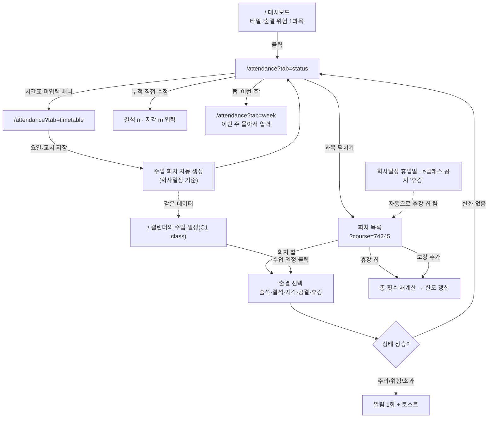

### 8-2. 라우트

| 경로 | 화면 |
|---|---|
| `/attendance` | 출결 — 과목별 현황 / 이번 주 / 시간표 설정 |

| 파라미터 | 값 | 기본값 | 히스토리 |
|---|---|---|---|
| `tab` | `status` `week` `timetable` | `status` | `replace` |
| `course` | e클래스 과목 id — 그 과목 회차 목록 펼침 | — | `replace` |
| `semester` | `2026-2` | 이번 학기 | `replace` |

> 회차 상세는 모달을 따로 만들지 않는다. 목록 행에서 바로 상태를 고른다(클릭 수를 줄이는 게 이 기능의 핵심).

### 8-3. 과목별 현황 탭

```
┌ 페이지 제목 ──────────────────────────────────────────────────────────────┐
│ ✅ 출결                       [2026-2학기 ▾]              [시간표 설정]    │
├───────────────────────────────────────────────────────────────────────────┤
│ ⓘ 학교 공식 출결 기록이 아닙니다 — 내가 입력한 값 기준입니다.              │  ← 고정
├───────────────────────────────────────────────────────────────────────────┤
│ ⚠ 확인하지 않은 수업 5회                                    [지금 입력]    │
├───────────────────────────────────────────────────────────────────────────┤
│ [과목별 현황] [이번 주] [시간표 설정]                                      │
├───────────────────────────────────────────────────────────────────────────┤
│  운영체제[2]            ████████░░░░  결석 7 / 7.25회  남은 여유 0회  위험 │
│    └ 총 29회 = 예정 30 − 휴강 1 + 보강 0     결석 6 · 지각 3 · 휴강 1 ▾   │
│  컴퓨터네트워크[1]      ███░░░░░░░░░  결석 2 / 7.75회  남은 여유 5회  안전 │
│  소프트웨어공학론[1]    ██████░░░░░░  결석 4 / 7.75회  남은 여유 3회  주의 │
└───────────────────────────────────────────────────────────────────────────┘
```

| 요소 | 동작 |
|---|---|
| 상태 배지 | `안전`(초록) `주의`(노랑) `위험`(주황) `초과`(빨강) — **글자 병기**, 색만으로 구분하지 않는다 |
| 근거 줄 | `총 29회 = 예정 30 − 휴강 1 + 보강 0 (휴강 중 1회는 학사일정·공지에서 자동)` 을 항상 보여 준다(F3-S02). **단위는 회 = 수업한 날**(2026-09-29) |
| 공지 확인 필요 | e클래스 공지에 휴강이 있는데 날짜를 못 찾았거나 그날 수업이 없으면 카드 안에 `⚠ e클래스 공지 '…'(링크) — 맞는 날에 휴강을 눌러 주세요` |
| `▾` 펼치기 | `?course=<id>` → 회차 목록이 그 자리에서 열린다 |
| 누적 수정 | `결석 3 · 지각 3` 을 눌러 숫자 직접 입력 → `직접 조정 +1` 칩 |
| 위험·초과 | 카드 테두리를 강조하고 목록 맨 위로 올린다 |

**회차 목록(펼친 상태)**

```
  9/02(화) 15:00~16:15  [출석] 결석  지각  공결  휴강        ← 누른 것이 채워진 칩
  9/04(목) 15:00~16:15   출석 [결석] 지각  공결  휴강
  9/09(화) 15:00~16:15   출석  결석  지각  공결 [휴강]        ← 휴강도 같은 줄의 칩
  9/17(목) 15:00~16:15   출석  결석  지각  공결 [휴강]
           자동 휴강 — e클래스 공지 · 9월 17일 목요일 휴강 ↗   ← 공지·학사일정에서 자동으로 켜진 휴강
  9/11(목) 15:00~16:15   출석  결석  지각  공결  휴강        ← 미입력(회색)
  9/16(화) 3·4교시   (다가옴)
                                          [+ 보강 추가]
```

- 상태 칩을 누르면 **즉시 저장**(낙관적) → 상단 숫자·막대가 같은 프레임에서 갱신된다.
- 칩은 **출석 · 결석 · 지각 · 공결 · 휴강** 다섯 개(2026-09-29 — 조퇴 없음). 같은 칩을 다시 누르면 미입력/휴강 해제, 휴강인 회차에서 출결 칩을 누르면 휴강을 풀고 그 출결로.
- 자동 휴강(학사일정 휴업일 · e클래스 공지)은 휴강 칩이 켜진 채로 오고 근거 한 줄(공지 링크)이 붙는다. 틀렸으면 칩을 눌러 푼다.
- 지난 회차인데 미입력이면 왼쪽에 점 표시. 다가올 회차는 흐리게 하고 **공결·휴강만** 누를 수 있다.

### 8-4. 이번 주 탭

이번 주 수업만 요일 순으로 모아 한 화면에서 처리한다. 밀린 입력을 빨리 끝내는 용도.

| 요소 | 동작 |
|---|---|
| 목록 | `월요일 9/28 — 컴퓨터그래픽스 1·2교시 [출석][결석][지각][공결][휴강]` 형태로 요일별. 위에는 지난 주들의 미입력 모음 |
| 일괄 | `모두 출석으로` 버튼(누른 뒤 개별 수정) |
| 범위 | `‹ 지난 주` / `다음 주 ›` 로 이동 (`?week=` 없이 컴포넌트 상태) |

### 8-5. 시간표 설정 탭

```
                                         [시간표 자동으로 가져오기]
과목                      요일·교시                한도    지각 환산
운영체제[2] (CIS2001)     월 5·6교시 · 수 5교시 [자동]  1/4 ▾  3회 = 결석1 ▾
컴퓨터네트워크[1]         수 1·2교시 [자동]            1/4 ▾  3회 = 결석1 ▾
동양의역사와문화[2]       [+ 요일·교시 입력]  ← 못 찾음  1/4 ▾  3회 = 결석1 ▾
                                                   [+ 수기 과목 추가]
학기: 개강 2026-09-01 · 종강 2026-12-19 (학사일정에서)      [직접 고치기]
※ 시험주처럼 수업이 없는 주는 회차 목록에서 '휴강'으로 표시하세요
```

| 요소 | 동작 |
|---|---|
| `시간표 자동으로 가져오기` | 학사정보시스템 시간표 조회(로그인 불필요)에서 **학수번호+분반**으로 찾아 요일·교시를 채운다. 채운 항목에 `자동` 칩, 사용자가 고치면 `수정함` |
| 과목 목록 | e클래스 `courses.json` 에서 자동. 이름·분반·코드는 읽기 전용 |
| 요일·교시 | 자동으로 못 찾은 과목만 직접 입력. 칩으로 추가·삭제, 주 2회 이상 가능 |
| 저장 | 저장하는 순간 **회차 재생성** → 토스트 "운영체제 회차 33개를 만들었습니다 — 휴강을 빼고 보강을 더해 총 32회" |
| 개강·종강 | F1 학사일정에서 자동. 못 찾으면 직접 입력 필드가 열린다 |
| 학기 복사 | `지난 학기에서 불러오기` (권장) |

### 8-6. 캘린더(C1)와의 연결

수업 회차는 **캘린더의 `class` 일정과 같은 데이터**다. 두 벌로 만들지 않는다.

| 위치 | 동작 |
|---|---|
| `/` 캘린더 | 수업이 과목 색 배경 블록으로. **주 뷰에서는 교시 대응표로 계산된 시각**(`13:00~14:50`)에 그려진다. 결석으로 찍힌 회차는 빨강 테두리 |
| 수업 일정 클릭 | `/?event=cl:<과목>:<날짜>` → 상세에 같은 칩 5개 `출석 / 결석 / 지각 / 공결 / 휴강` + 자동 휴강 근거 |
| 휴강 | C1 반복 규칙의 **예외**로 저장(4-6 절). 총 횟수가 즉시 줄어든다. 캘린더에서는 취소선 + `휴강`(자동이면 `휴강·자동`) |
| 보강 추가 | 캘린더에서 날짜를 골라 추가해도 `/attendance` 에 반영된다 |

### 8-7. 컴포넌트·API

```
app/attendance/page.tsx          (신규) 탭 3개
components/attendance/
  CourseStatusCard.tsx   과목별 막대·상태 배지·근거 줄·누적 수정
  SessionList.tsx        회차 목록 + 상태 칩 + 휴강/보강
  WeekCheck.tsx          이번 주 몰아서 입력
  TimetableEditor.tsx    요일·교시·한도·환산 설정
```

| 시점 | 호출 |
|---|---|
| 현황 | `GET /api/attendance/summary?semester=2026-2` — 과목마다 회차 목록까지 한 번에 온다(7과목 × 30회차, 탭 전환에 추가 요청 없음) |
| 회차 목록 | `GET /api/attendance/sessions?course=<id>&from=&to=` (다른 기능용 — 화면은 summary 를 쓴다) |
| 출결 찍기 | `PATCH /api/attendance/sessions/{id}` `{attendance}` — 다시 계산한 과목 + 새 경고(`alerts`)를 돌려준다 |
| 휴강·되돌리기 | `PATCH .../sessions/{id}` `{state:"canceled"\|"scheduled"}` (자동 휴강 회차에 `scheduled` = 수업함). 휴강을 풀면서 출결은 `{state:"scheduled", attendance}` 한 번 |
| 보강 | `POST /api/attendance/sessions` `{courseId, date, periods}` · 내가 추가한 보강만 `DELETE .../sessions/{id}` |
| 몰아서 입력 | `POST /api/attendance/sessions/bulk` `{items:[{id, attendance}]}` — `모두 출석으로` |
| 누적 수정·설정 | `PATCH /api/attendance/courses/{id}` `{adjust:{absent, late}}` · `{limitRatio}` · `{lateToAbsence}` · `{countEarlyLeaveAsLate}` · `{excluded}` |
| 시간표 자동 수집 | `POST /api/attendance/timetable/import` → `GET` 으로 진행 상태(`progress`) — 학사정보시스템 시간표 조회 파싱(`강의시간` → 요일·교시) |
| 시간표 저장 | `PUT /api/attendance/timetable` `{courses:[{courseId, meetings}], validFrom?}` → 회차 재생성 결과(`generated`)를 응답에 포함 · `DELETE .../timetable/{courseId}` 자동값으로 되돌리기 |
| 학기·교시 | `PUT /api/attendance/semester` 개강·종강·휴업일 · `PUT/DELETE /api/attendance/periods` 교시 ↔ 시각 |
| 캘린더 | 같은 회차가 `GET /api/events` 에 `kind:"class"` 로 함께 온다(휴업일 회차는 빼고). **주·목록 보기에서만** 그린다 — 월·학기 격자는 마감이 '+N개'로 밀리므로 뺀다 |
| 알림 | 상태가 올라가면 서버가 알림 센터(`/api/notifications`, `kind:"attendance"`, `href:/attendance?course=`)에 넣는다. 헤더 종은 `/api/status` 의 `attendance.updatedAt` 이 바뀌면 다시 받는다 |

> 구현(2026-09-28): 컴포넌트는 위 4개 + 출결 칩 공용 부품 `AttendanceChips.tsx`(회차 목록·이번 주·캘린더 수업 상세가 같이 쓴다). 데이터 훅은 `lib/useAttendance.ts`. 자세한 결정은 요구사항정의서 F3 12절.

### 8-8. 로딩·빈·에러

| 상황 | 화면 |
|---|---|
| 시간표 미입력 | 과목은 보이되 숫자 자리에 `—` + `시간표 자동으로 가져오기` 버튼 |
| 자동 수집 실패 | 그 과목만 `요일·교시를 직접 넣어 주세요` (나머지 과목은 정상 동작) |
| 개강·종강 없음 | 시간표 탭 상단에 "학사일정에서 개강·종강을 찾지 못했습니다" + 직접 입력 |
| 과목 목록 없음 | "e클래스 동기화를 먼저 해 주세요" + `/settings/sources` 링크 |
| 회차 0개 | "이번 학기 수업 일정이 없습니다" |
| 저장 실패 | 칩을 이전 상태로 되돌리고 토스트 |

### 8-9. 반응형

| 폭 | 현황 탭 |
|---|---|
| ≥ 1280px | 과목 카드 1열, 막대·숫자·상태가 한 줄 |
| 768~1279px | 동일하되 근거 줄이 아래로 |
| < 768px | 카드 2줄(과목명 / 막대·상태), 회차 목록의 상태 칩은 가로 스크롤 없이 2행 배치 |

---

## 9. F4 — 강의자료 요약·예상 문제 (RAG)

요구사항은 [요구사항정의서.md](요구사항정의서.md) F4 절. 모델은 AI팀이 정하지만 **화면은 모델을 모른다** — 5절 계약(요약·문제·답변에 `citations` 가 붙는다)만 지켜지면 된다.

### 9-1. 화면 흐름도

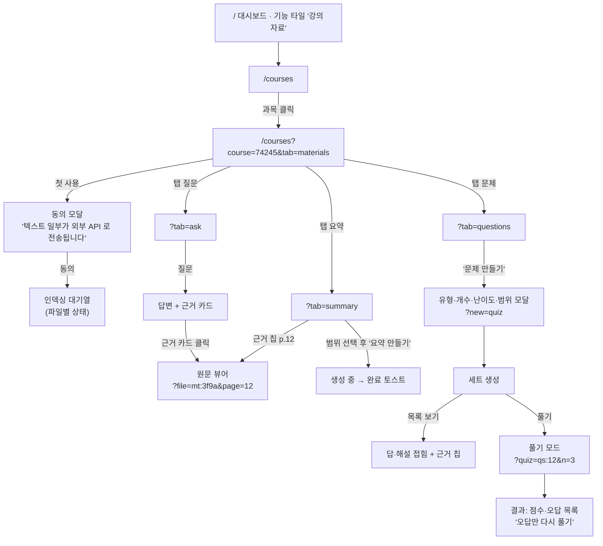

### 9-2. 라우트

| 경로 | 화면 |
|---|---|
| `/courses` | 과목 목록 (자료 수·인덱싱 상태) |
| `/courses?course=<id>` | 과목 상세 — 자료 / 요약 / 문제 / 질문 탭 |

| 파라미터 | 값 | 기본값 | 히스토리 |
|---|---|---|---|
| `course` | e클래스 과목 id | — (없으면 목록) | `push` |
| `tab` | `materials` `summary` `questions` `ask` | `materials` | `replace` |
| `file` + `page` | 원문 뷰어 (`mt:…` + 쪽수) | — | `push` (모달) |
| `new` | `quiz` — 문제 만들기 모달 | — | `push` |
| `quiz` + `n` | 풀기 모드 세트 id + 문항 번호 | — | `push` |
| `range` | `3-7` — 주차 범위 필터 | 전체 | `replace` |

> **풀기 모드는 라우트가 아니라 전체 화면 모달**이다. `?quiz=` 가 붙으면 열리고 뒤로가기로 닫힌다. 문항 이동(`n`)은 `replace` — 뒤로가기로 이전 문항이 아니라 목록으로 나가야 자연스럽다.

### 9-3. 과목 상세 — 자료 탭

```
┌ 소프트웨어공학론[1] (CIS3030) ────────────────────────────────────────────┐
│ [자료 12] [요약] [문제] [질문]                         [+ 파일 추가]      │
├───────────────────────────────────────────────────────────────────────────┤
│ 📄 1-1 Course Introduction.pdf      13쪽  e클래스  ✅ 준비됨              │
│ 📄 2-1 소프트웨어품질1.pdf          38쪽  e클래스  ⏳ 분석 중 (2/7)       │
│ 📄 3주차 보충자료.pdf               21쪽  직접 추가 ✅ 준비됨   [삭제]    │
│ 📄 스캔본_필기.pdf                  —     직접 추가 ⚠ 텍스트 없는 PDF     │
└───────────────────────────────────────────────────────────────────────────┘
        ↑ 끌어다 놓아도 추가됩니다
```

| 요소 | 동작 |
|---|---|
| 파일 행 | 클릭 → 원문 뷰어(`?file=`). 아래 줄에 `3주차(추정) · 45쪽 · 2.3MB · 강의자료 · <활동·게시글 이름>` |
| 종류 필터·검색 | `전체 / 강의자료 / 게시판 첨부 / 과제 첨부 / 직접 추가` + 파일 이름 검색 (화면 안에서만 거른다) |
| 행 오른쪽 | `내려받기` · `e클래스에서 보기`(원문 링크) · `삭제`(직접 추가분만, 수집분은 자물쇠) |
| 상태 | `분석 대기 / 분석 중 / 준비됨 / 분석 실패 / 텍스트 없는 PDF / 열 수 없음(암호) / 분석 제외 / 중복 파일 / 파일 없음` — 색만으로 구분하지 않고, 사유 한 줄을 그 아래 적는다 |
| 드래그 앤 드롭 | 영역 전체가 드롭 타깃. 100MB·문서 확장자만. 올리면 바로 목록에 들어간다 |
| 삭제 | 직접 추가분과 **e클래스에서 내려간 보관본**만. 아직 올라와 있는 자료는 잠근다(지워도 다음 스캔에 다시 들어온다) |
| 자료 보관 | 수집분은 F4 보관함(`F4_Textbook_agent/data/materials/`)으로 들여와 거기서 연다 — 목록 아래에 보관함 경로를 적어 준다 |
| `다시 훑기` | 수집 폴더를 다시 읽는다(F6 동기화 없이 파일만 바뀐 경우) |
| `e클래스에서 가져오기` | 과목 목록 화면의 버튼 = F6 동기화(`POST /api/sync`). 자료를 받아오는 일은 F6 가 한다 |

### 9-4. 요약 탭

```
범위 [전체 ▾] [3~7주차] [중간고사 범위]              [요약 만들기]

┌ 2-1 소프트웨어품질1 ──────────────────────────────────────────────────────┐
│ ▸ 소프트웨어 품질의 정의                                                   │
│    · 품질은 명세 충족도와 사용자 기대의 교집합이다           [p.4] [p.6]   │
│    · ISO 9126 은 6가지 품질 특성을 정의한다                  [p.11]       │
│ ▸ 핵심 용어                                                               │
│    문맥 교환 — …                                              [p.18]      │
│                                    모델 · 프롬프트 v1 · 9/25   [다시 생성] │
└───────────────────────────────────────────────────────────────────────────┘
```

| 요소 | 동작 |
|---|---|
| `[p.12]` 근거 칩 | `?file=mt:…&page=12` → 원문 뷰어가 그 쪽에서 열린다 |
| 범위 필터 | `?range=3-7` — 요약·문제 탭이 같은 범위를 공유한다 |
| `과목 전체 핵심 정리` | 파일 요약 위쪽에 접히는 카드로 |
| 생성 중 | 카드 자리에 스켈레톤 + 진행 표시. 기존 요약은 그대로 보인다 |

### 9-5. 문제 탭과 풀기 모드

```
목록 보기                                   풀기 모드 (?quiz=qs:12&n=3)
┌──────────────────────────────┐          ┌──────────────────────────────┐
│ Q3. 문맥 교환이 발생하지 않는 │          │  3 / 10            ●●○○○○○○○○ │
│     경우는?           [객관식]│          │ 문맥 교환이 발생하지 않는     │
│  ① …  ② …  ③ …  ④ …          │          │ 경우는?                      │
│                               │          │  ① …                         │
│  [답 보기 ▾]          [p.18]  │          │  ② …                         │
└──────────────────────────────┘          │           [제출]             │
                                           └──────────────────────────────┘
                                                      ↓ 제출 즉시
                                           ┌──────────────────────────────┐
                                           │ ✅ 정답   해설 …      [p.18] │
                                           │              [다음 문제 →]   │
                                           └──────────────────────────────┘
```

| 요소 | 동작 |
|---|---|
| `문제 만들기` | `?new=quiz` 모달 — 유형(객관식/단답/서술) · 개수 · 난이도 · 범위 |
| `답 보기` | 그 문항만 펼침. 목록에서는 기본 접힘 |
| 풀기 모드 | 전체 화면. 숫자키로 선택, Enter 제출, `→` 다음 문항 |
| 결과 화면 | 점수 · 오답 목록 · `오답만 다시 풀기`(새 세트가 아니라 같은 세트의 필터) |
| 서술형 | 채점하지 않고 `모범답안과 비교` 만 보여 준다 |
| 문제 버리기 | 목록에서 `숨기기` — 다시 생성해도 되살아나지 않는다 |

### 9-6. 질문 탭

| 요소 | 동작 |
|---|---|
| 입력 | 한 줄 입력 + 전송. 검색 범위는 **그 과목 자료로 고정**(화면에 명시) |
| 답변 | 본문 아래 **근거 카드** — `파일명 · p.12 · "원문 인용"`, 클릭하면 원문 뷰어 |
| 못 찾음 | `자료에서 찾지 못했습니다` 한 줄만. 추측 답변을 만들지 않는다 |
| 대화 | 과목별로 남는다. `대화 지우기` |

### 9-7. 원문 뷰어

| 항목 | 규칙 |
|---|---|
| 여는 법 | `?file=mt:…&page=12` (`push`) — 요약·문제·질문 어디서든 같은 뷰어 |
| 표시 | PDF 를 앱 안에서 렌더링하고 해당 페이지로 이동. 인용 문장이 있으면 하이라이트 |
| 1차 구현 | 브라우저 내장 PDF 뷰어를 `iframe` 으로 쓴다(`/api/materials/{id}/file#page=12`) — 쪽 이동·검색·인쇄가 이미 된다. 하이라이트가 필요해지면 그때 pdf.js(미결 Q5). `.hwp`·`.pptx` 처럼 못 그리는 형식은 `내려받아서 보세요` + 내려받기 버튼 |
| 닫기 | 뒤로가기·ESC → 원래 탭과 스크롤 위치로 복귀 |
| 큰 파일 | 해당 페이지 주변만 먼저 렌더링 |

### 9-8. 컴포넌트·API

```
app/courses/page.tsx                 목록 + 과목 상세(쿼리로 분기)
components/pages/CoursesPage.tsx     ✅ 목록 · 자료 탭 · 원문 뷰어(진짜) + 요약·문제·질문(예시)
lib/materials.ts · lib/useMaterials.ts  ✅ /api/materials 타입과 데이터 훅 (업로드·삭제·다시 훑기)
  MaterialsTab        파일 목록 · 종류 필터 · 검색 · 드롭존 · 열기/내려받기/삭제
  SourceViewer        원문 뷰어(공용) — PDF·텍스트는 iframe, 그 밖은 내려받기 안내
  SummaryPanel ⏳     요약 카드 + 근거 칩 + 범위 필터
  QuestionList ⏳     문제 목록(접힘) · QuizRunner 풀기 모드 · AskPanel 질문 채팅
  CitationChip        `[p.12]` — 모든 생성물이 공유
```

| 시점 | 호출 |
|---|---|
| 과목·자료 목록 | `GET /api/materials?course=<id>&kind=&q=` — 과목 요약(목록 화면)과 자료 목록을 한 번에 |
| 상태(타일·폴링) | `GET /api/materials/status` — 자료 수·쪽수·확인 필요·마지막 스캔 |
| 다시 훑기 | `POST /api/materials/scan?force=1` — 수집 폴더를 다시 읽는다(쪽수·해시까지) |
| 업로드 | `POST /api/materials?course=<id>&name=<파일이름>` — **본문이 파일 그대로**(`fetch(url,{method:'POST',body:file})`). multipart 가 아니다 |
| 자료 하나 | `GET /api/materials/{id}` · 삭제 `DELETE /api/materials/{id}`(직접 추가분만) |
| 원문 | `GET /api/materials/{id}/file` (inline) · `?download=1` (내려받기) — 로컬 파일 스트림, Range 지원 |
| 요약 | `GET /api/summaries?scope&target` · `POST /api/summaries` (생성) ⏳ |
| 문제 | `GET /api/questionsets?course=<id>` · `POST /api/questionsets` ⏳ |
| 풀이 | `POST /api/quiz/attempts` · `PATCH /api/quiz/attempts/{id}` ⏳ |
| 질문 | `POST /api/ask` `{courseId, question}` → `{text, citations, found}` ⏳ |

> ⏳ 표시는 아직 없는 API 다(모델 선정 뒤). 1차 구현(2026-09-30)은 **자료 탭과 원문 뷰어까지** — 요약·문제·질문 탭은 예시 데이터로 서 있다.
> 자료 한 줄이 주는 값: `id · courseId · title · source(eclass|upload) · kind(lecture|board|assignment|upload) · kindLabel ·
> activity · post · ext · pages · sizeMB · week · weekGuess · stored(link|copy|upload|eclass) · detached ·
> state · stateLabel · note · viewable · canDelete · eclassUrl · fileUrl · downloadUrl`.
> `state` 는 `pending`(분석 대기) · `running` · `done` · `failed` · `ocr_needed`(텍스트 없는 PDF) · `locked`(암호) ·
> `unsupported`(분석 제외) · `duplicate`(중복) · `missing`(파일 없음) — 화면은 `stateLabel` 을 그대로 쓴다.
> 파일은 F4 보관함에서 온다(`stored`) — `detached` 는 e클래스에서 내려갔지만 보관본이 남은 자료로, **이때만 삭제가 열린다**.

### 9-9. 로딩·빈·에러

| 상황 | 화면 |
|---|---|
| 첫 사용(동의 전) | 동의 모달. 동의 전에는 인덱싱·생성 버튼이 잠긴다 |
| 인덱싱 중 | 요약·문제·질문 탭 비활성 + `자료를 준비하는 중입니다 (3/7)` |
| 자료 없음 | "강의자료가 없습니다 — e클래스 동기화 또는 파일 추가" |
| 생성 실패 | 카드 자리에 "만들지 못했습니다" + 사유 한 줄 + `다시 시도` |
| 근거 부족 | 요약 하단에 `근거를 찾은 항목만 표시했습니다 (2건 제외)` |
| API 미설정·한도 | 상단 띠로 안내. **자료 목록과 원문 뷰어는 계속 동작한다** |
| 보관 실패 | 그 자료 줄에 사유 한 줄(권한·디스크 등). 원문은 수집 폴더에서 그대로 열린다 |

### 9-10. 반응형

| 폭 | 과목 상세 |
|---|---|
| ≥ 1280px | 왼쪽 자료/요약 본문 + 오른쪽 원문 뷰어를 **나란히** 열 수 있다 |
| 768~1279px | 원문 뷰어가 모달로 덮는다 |
| < 768px | 탭이 가로 스크롤, 풀기 모드는 전체 화면, 근거 칩은 탭 대신 하단 시트로 원문 |

---

## 10. F5 — 시험 공부 일정 추천

요구사항은 [요구사항정의서.md](요구사항정의서.md) F5 절. 화면의 중심은 **미리보기**다 — 계획을 캘린더에 넣기 전에 "하루에 이만큼"을 눈으로 확인시키는 것이 이 기능의 신뢰도를 만든다.

### 10-1. 화면 흐름도

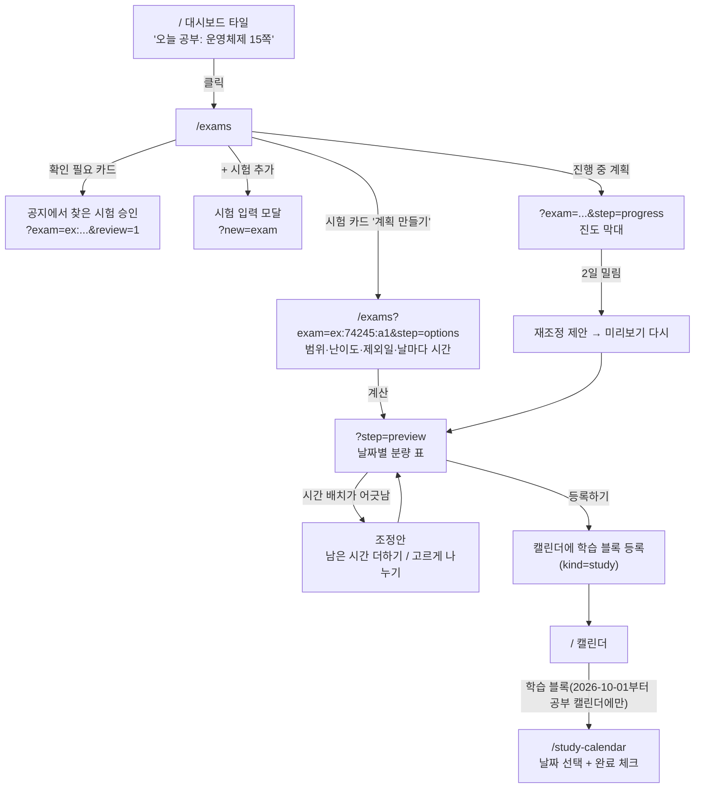

### 10-2. 라우트

| 경로 | 화면 |
|---|---|
| `/exams` | 시험 목록 + 계획 만들기·진도 (단계는 쿼리로) |

| 파라미터 | 값 | 기본값 | 히스토리 |
|---|---|---|---|
| `exam` | `ex:…` — 그 시험의 패널 열기 | — | `push` |
| `step` | `options` `preview` `progress` | 계획 없으면 `options`, 있으면 `progress` | `replace` |
| `new` | `exam` — 시험 추가 모달 | — | `push` |
| `review` | `1` — 확인 필요 목록만 | — | `replace` |
| `setup` | `courses` — 과목별 시험(중간·기말 유무) 모달 (2026-10-01, 임의 일정 배너의 버튼) · `difficulty` — 난이도 시간 설정 모달 (2026-10-02, 헤더 버튼) | — | `push` |
| `study` | 시험 id — **자료 체크** 모달 (2026-10-06, 카드의 `자료 체크` 버튼). 서비스 밖에서 공부한 강의자료 체크·해제, `계획 다시 만들기` 는 `study` 를 지우고 `exam=…&step=options` 로 바꾼다(`replace`) | — | `push` |

> 계획 만들기는 **페이지를 옮기지 않는다**. 같은 `/exams` 위에서 `옵션 → 미리보기 → 등록` 3단계가 오른쪽 패널로 진행된다. 중간에 나갔다 와도 `?exam=&step=` 로 그 자리에서 이어진다.

### 10-3. `/exams` 목록

```
┌ 🎯 시험                                                  [+ 시험 추가]   │
├───────────────────────────────────────────────────────────────────────────┤
│ ⚠ 공지에서 찾은 시험 2건 — 확인이 필요합니다              [확인하러 가기] │
├───────────────────────────────────────────────────────────────────────────┤
│ ┌───────────────────────────────────────────────────────────────────────┐ │
│ │ D-10   운영체제[2]  중간고사       10/23(수) 14:00  공7-223           │ │
│ │        범위 3~7주차 · 자료 120쪽                                       │ │
│ │        ▓▓▓▓▓░░░░░  진도 45/120쪽   ⚠ 2일 밀림      [재조정] [진도]    │ │
│ └───────────────────────────────────────────────────────────────────────┘ │
│ ┌───────────────────────────────────────────────────────────────────────┐ │
│ │ D-12   컴퓨터네트워크[1]  중간고사  10/25(금) 10:00                    │ │
│ │        범위 미지정 · 자료 —                       [계획 만들기]       │ │
│ └───────────────────────────────────────────────────────────────────────┘ │
└───────────────────────────────────────────────────────────────────────────┘
```

| 요소 | 동작 |
|---|---|
| D-day 칩 | 7일 이내면 강조 |
| 진도 막대 | 계획이 있을 때만. 밀리면 주황 + `재조정` |
| `계획 만들기` | `?exam=…&step=options` (`push`) |
| 확인 필요 배너 | 공지 추출분(신뢰도 낮음)을 승인하는 목록으로 |
| 시험 카드 근거 | 공지에서 왔으면 `공지 원문 보기 ↗` 링크 |

### 10-4. 계획 만들기 — 옵션 → 미리보기

```
[옵션]                                    [미리보기]
범위    3~7주차 ▾   자료 120쪽 (자동)     10/13(월) 15쪽 · 38분
난이도  보통 ▾      2.5분/쪽              10/14(화) 15쪽 · 38분
(하루 상한 없음 — 2026-10-07)                10/15(수)  — 제외일
제외일  10/15 ✕  10/19 ✕   [+ 날짜]       10/16(목) 18쪽 · 45분
마무리 복습 2일 ▾                          …
예상 문제 풀이 포함 ☑                      10/21(화) 전체 복습
                                           10/22(수) 전체 복습 + 문제 20
                    [계산하기]              ─────────────────────────
                                           합계 120쪽 · 5시간 12분
                                           [다시 계산]    [등록하기]
```

| 요소 | 동작 |
|---|---|
| 범위 | F4 자료에서 쪽수 자동 채움. 자료가 없으면 직접 입력 필드로 바뀐다 |
| 제외일 | 칩으로 추가·삭제. 지우면 즉시 재분배 |
| ~~상한 초과~~ | **삭제 (2026-10-07)** — 하루 기준(4시간) 경고·조정안·한 번 더 확인이 없다 |
| 겹침 | 다른 과목 계획과 합산해 `10/20 에 3과목 5시간` 표시 |
| `등록하기` | 학습 블록 생성 → 토스트 `8일치 학습 계획을 캘린더에 넣었습니다` + `캘린더에서 보기` |

### 10-5. 진도·재조정

| 요소 | 동작 |
|---|---|
| 진도 막대 | `완료 45 / 계획 120쪽`, 오늘까지 계획 대비 지연을 따로 표시 |
| 밀림 배너 | `2일 밀렸습니다 — 남은 6일로 다시 나누면 하루 19쪽입니다` + `재조정하기` |
| 재조정 | 미리보기를 다시 열어 보여 주고, 확인해야 캘린더가 바뀐다(자동 변경 없음) |
| 계획 취소 | `계획 취소` → 미완료 블록만 캘린더에서 지운다(완료분은 남김) |

### 10-6. 캘린더·대시보드 연동

| 위치 | 내용 |
|---|---|
| `/` 캘린더 | 학습 블록(`kind=study`, id `st:<계획>:<날짜>`)이 `#4D7C0F` 책 아이콘으로. 완료하면 흐리게 + 취소선 |
| 학습 블록 | **2026-10-01부터 전체 캘린더(`/`)에 넣지 않는다** — 공부 캘린더(`/study-calendar`)에서 날짜를 눌러 보고 완료 체크 |
| 대시보드 타일 | `오늘 공부: 운영체제 15쪽 (38분)` + 가장 가까운 시험 D-day |
| 시험 자체 | 캘린더에 `kind=exam`(id `ex:…`, `#B91C1C`)으로도 표시 — 학습 블록과 구분되는 아이콘. 시각이 없으면 종일 일정 |

### 10-7. 컴포넌트·API

```
app/exams/page.tsx              (신규) 목록 + 우측 패널(옵션/미리보기/진도)
components/exams/
  ExamCard.tsx        D-day·범위·진도·근거 링크
  ExamForm.tsx        시험 추가·수정 모달
  PlanOptions.tsx     범위·난이도·제외일 (하루 상한 없음)
  PlanPreview.tsx     날짜별 분량 표 + 경고 + 조정안
  ProgressPanel.tsx   진도 막대 + 재조정
```

구현 (2026-09-30 백엔드 · 2026-10-01 화면, `F5_Test_agent/exams/api.py` + `components/pages/ExamsPage.tsx` · `components/exams/*` · `lib/exams.ts` · `lib/useExams.ts` — 요구사항정의서 F5 11절):

| 시점 | 호출 |
|---|---|
| 시험 목록 | `GET /api/exams?semester=&sync=1` — `exams`·`past`·`review`·`counts`·`today`·`source`·`types`·`difficulties`·`capChoices` |
| 공지에서 다시 찾기 | `POST /api/exams/sync` (목록을 그냥 부를 때도 공지 목록이 바뀌었으면 알아서 다시 읽는다) |
| 공지 추출분 승인 | `PATCH /api/exams/{id}` `{status:"confirmed", date, time}` — 손대면 재수집이 덮어쓰지 않는다 |
| 시험 추가 · 삭제 | `POST /api/exams` · `DELETE /api/exams/{id}` |
| 시험 하나 (옵션 기본값·범위 후보) | `GET /api/exams/{id}` — `options`·`scopeChoices{weeks, materials}` 가 함께 온다 |
| 계획 계산 | `POST /api/study-plans/preview` → 등록하지 않고 결과만 (`days`·`totals`·`verdict`·`warnings`·`adjustments` — `overlap`·`needsConfirm` 은 2026-10-07 삭제) |
| 계획 등록 | `POST /api/study-plans` → 학습 블록까지 생성 |
| 조정안 적용 | 같은 본문에 `apply` 를 넣어 다시 부른다 (`{...options, apply: {capMinutes: 300}}`) |
| 진도 | `PATCH /api/study-plans/{id}/days/{date}` `{done}` · 옮기기는 `{date}` |
| 블록 상세 (그날 볼 자료) | `GET /api/study-plans/{id}/days/{date}` — F4 자료 목록이 함께 온다 |
| 재조정 | `POST /api/study-plans/{id}/rebalance` → 미리보기 결과 반환 (캘린더는 그대로) |
| 취소 | `DELETE /api/study-plans/{id}` — 미완료 블록만 지운다 |
| 오늘 분량 (대시보드 타일) | `/api/status` 의 `exams` 칸 또는 `GET /api/exams/today` |
| 과목별 시험 (2026-10-01) | 목록의 `courseSettings`·`defaults` 를 쓰고, 바꿀 때 `PATCH /api/exams/courses/{courseId}` `{midterm?, final?}` |
| 공부 캘린더 (2026-10-01) | `GET /api/study-calendar?start=&end=` · 화면은 백엔드의 `/study-calendar`(next dev 에서도 rewrites 로 넘긴다) |

> **임의 일정** (2026-10-01): 모든 과목은 중간·기말을 본다고 두고, 일정이 없으면 학사일정 수업평가 기간 안의 수업 요일로 잡는다(`isAuto`).
> 카드·캘린더에 점선 `임의 일정`과 어떻게 잡았는지(`note`)를 보여 주고, 공지에서 일정이 나오면 `일정 확정`으로 바뀐다. 지우기 확인창은
> "지우면 이 과목은 이 시험을 안 봄 — 날짜만 틀렸다면 ✏로 고치세요"를 먼저 말한다.

> **미리보기와 등록을 나눈 이유**: 같은 계산기를 두 번 쓰되 등록만 부수효과를 갖게 해서, 화면이 "계산 결과"와 "실제 캘린더"를 헷갈리지 않게 한다.

### 10-8. 로딩·빈·에러

| 상황 | 화면 |
|---|---|
| 시험 없음 | "등록된 시험이 없습니다 — 공지에서 자동으로 찾거나 직접 추가하세요" + `+ 시험 추가` |
| 자료 없음 | 범위 칸에 `쪽수를 직접 입력하세요` (계획 생성은 계속 가능) |
| ~~상한 초과~~ | **삭제 (2026-10-07)** — 경고 없이 등록한다. 날마다의 분량은 저녁 시간대(기본 19:00~24:00)에 공부 캘린더로 놓인다 |
| 시간 없음(D≤0) | 계획 대신 `남은 시간에는 요약과 예상 문제를` + F4 바로가기 |
| 등록 실패 | 토스트 + 미리보기 유지(작업 내용을 잃지 않는다) |

### 10-9. 반응형

| 폭 | `/exams` |
|---|---|
| ≥ 1280px | 왼쪽 시험 목록 + 오른쪽 패널(옵션/미리보기/진도) 2단 |
| 768~1279px | 목록 위 · 패널 아래 |
| < 768px | 시험 카드만 보이고, 계획 단계는 **전체 화면 시트**로 열린다 |

---

## 11. F6 — 과제 마감 자동 등록

요구사항은 [요구사항정의서.md](요구사항정의서.md) F6 절. **화면의 절반은 이미 있다** — 캘린더의 마감과 오른쪽 할 일 목록이 그것이다. 새로 만드는 것은 `/assignments` 목록과 **수집 상태를 정직하게 보여 주는 장치**다.

### 11-1. 화면 흐름도

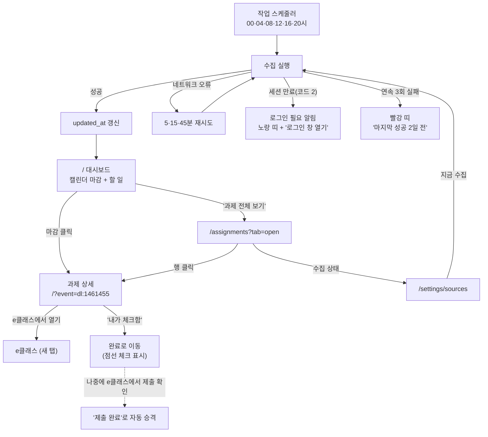

### 11-2. 라우트

| 경로 | 화면 |
|---|---|
| `/assignments` | 과제·마감 목록 (탭: 진행 중 / 완료 / 지난 마감) |

| 파라미터 | 값 | 기본값 | 히스토리 |
|---|---|---|---|
| `tab` | `open` `done` `past` | `open` | `replace` |
| `course` | 과목 id — 그 과목만 | 전체 | `replace` |
| `event` | `dl:<cmid>` — 과제 상세 모달 | — | `push` |

> 상세 모달은 **캘린더와 같은 `?event=dl:…`** 을 쓴다(C1 4-4절). `/` 에서 열든 `/assignments` 에서 열든 같은 컴포넌트다.

### 11-3. `/assignments` 목록

```
┌ 📌 과제·마감                              [전체 과목 ▾]   수집: 12:00 ✅ │
├───────────────────────────────────────────────────────────────────────────┤
│ ⚠ 마지막 성공이 2일 전입니다 — e클래스 로그인이 필요할 수 있습니다 [로그인]│  ← 실패 시만
├───────────────────────────────────────────────────────────────────────────┤
│ [진행 중 5] [완료 12] [지난 마감 1]                                        │
├───────────────────────────────────────────────────────────────────────────┤
│ 🔴 D-0  운영체제[2]        3주차 실습 과제      오늘 23:59   미제출        │
│ 🟠 D-1  소프트웨어공학론[1] 품질 보고서         내일 18:00   미제출  변경됨 │
│ ⚪ D-3  컴퓨터네트워크[1]   퀴즈 2회            9/28 23:59   퀴즈          │
│ ⚪ D-5  컴퓨터그래픽스[2]   4주차 동영상 시청    9/30 23:59   동영상        │
└───────────────────────────────────────────────────────────────────────────┘
```

| 요소 | 동작 |
|---|---|
| D-day 칩 | 당일 빨강 · D-1 주황 · 그 외 회색. **색만으로 구분하지 않고 `D-0` 글자 병기** |
| 유형 칩 | `과제` / `퀴즈` / `동영상` — 수집 원천이 다름을 보여 준다 |
| `변경됨` 칩 | 마감이 바뀐 항목. 상세에 이전 일시가 취소선으로 |
| 과목 필터 | `?course=` — 캘린더 필터와 별개(목록 전용) |
| 수집 상태 | 헤더 오른쪽 `수집: 12:00 ✅` → 누르면 `/settings/sources` |

### 11-4. 과제 상세 모달

```
┌ 3주차 실습 과제                                            [×] │
│ 운영체제[2] (CIS2001)                                          │
│ 마감 2026-09-26 23:59   ~~09-24 23:59~~ 변경됨      D-0        │
│ ─────────────────────────────────────────────────────────────  │
│ 제출 여부   미제출        채점 상황  채점되지 않음              │
│ 첨부        실습3_안내.pdf                                      │
│ ─────────────────────────────────────────────────────────────  │
│ 설명                                                            │
│ 이번 주 실습은 프로세스 스케줄링 시뮬레이터를 …                 │
│ ─────────────────────────────────────────────────────────────  │
│ ☐ 내가 체크함 (e클래스 밖에서 제출한 경우)                      │
│                              [e클래스에서 열기 ↗]              │
└─────────────────────────────────────────────────────────────────┘
```

| 요소 | 동작 |
|---|---|
| 마감 | 바뀐 이력이 있으면 이전 일시를 취소선으로 함께 |
| `내가 체크함` | 즉시 저장(낙관적) → 완료 탭으로 이동 + 토스트 `완료로 표시했습니다 [되돌리기]` |
| 표시 구분 | e클래스 `제출 완료` = **채운 체크 ✅**, `내가 체크함` = **점선 체크 ☑︎ + "내가 체크함"** 문구 |
| 자동 승격 | 다음 수집에서 실제 제출이 확인되면 점선 → 채운 체크로 바뀌고 토스트 없이 조용히 갱신 |
| 잠금 | 마감 일시·제목은 수정 불가(읽기 전용) |

### 11-5. 대시보드의 `e클래스 동기화` 버튼 (현재 구현)

주기 실행을 기다리지 않고 **사용자가 직접 당기는** 경로. 이미 만들어져 있고, 화면 규칙만 확정한다.

```
⚡ 빠른 실행
 [e클래스 동기화]   방금 · 과제 23건
 [학사일정 동기화]  3분 전 · 12건
```

| 상태 | 버튼 | 옆 문구 |
|---|---|---|
| 평소 | `e클래스 동기화` (누를 수 있음) | `12:00 · 과제 23건` |
| 내가 눌러 실행 중 | 비활성 + 스피너 | `동기화 중…` |
| 예약 실행이 도는 중 | 비활성 | `예약 동기화 진행 중…` |
| 방금 성공 | 활성 | `방금 · 새 과제 2건` (5초 뒤 평소 문구로) |
| 세션 만료 | 활성 | 빨강 `로그인이 필요합니다` + `로그인 창 열기` |
| 실패 | 활성 | 빨강 사유 한 줄 + `자세히`(로그 끝부분 펼치기) |

| 규칙 | 내용 |
|---|---|
| 중복 실행 | `POST /api/sync` 가 `already_running: true` 를 주면 **새로 띄우지 않고** 상태만 반영한다 |
| 실행 주체 구분 | `source: button`(내가 누름) / `external`(예약·수동 실행) — 문구가 다르다 |
| 폴링 | 진행 중 **3초**, 평소 **1분** 간격으로 `GET /api/status` |
| 완료 처리 | `updated_at` 이 바뀌면 캘린더·할 일·과제 목록을 다시 불러온다 |
| 같은 버튼 | `/settings/sources` 의 `지금 수집`, 과제 목록 헤더의 수집 표시도 **같은 실행**을 공유한다 |

> 버튼을 여러 화면에 두되 **실행은 하나**다. 한 화면에서 돌리면 다른 화면의 버튼도 같이 비활성된다(상태를 `/api/status` 하나로 본다).

### 11-6. 수집 상태 — `/settings/sources` 의 e클래스 행

```
e클래스 (과제·마감·강의자료)                              [지금 수집]
  주기  4시간 (00·04·08·12·16·20시) ▾
  마지막 성공  오늘 12:00 · 과목 7 · 과제 23 · 파일 4건
  최근 실행
    12:00  ✅ 성공        38초
    08:00  ⚠ 재시도 2회 후 성공 (네트워크)
    04:00  ❌ 세션 만료 — 로그인 필요
```

| 요소 | 동작 |
|---|---|
| 주기 | 2·4·6·12시간 중 선택(F6-R18). 바꾸면 작업 스케줄러 재등록 |
| 최근 실행 | 시각·결과·소요·건수. 실패는 사유 한 줄 |
| `지금 수집` | 진행 중이면 비활성 + `진행 중…`. 예약 실행 중이면 `예약 동기화 진행 중…` |
| 로그인 필요 | 행 안에 `로그인 창 열기` 버튼(로컬에서 Playwright 창을 띄움) |

### 11-7. 실패를 숨기지 않는 규칙

이 기능에서 가장 위험한 실패는 **"조용히 옛날 데이터를 보여 주는 것"** 이다.

| 상태 | 화면 |
|---|---|
| 정상 | 헤더에 `수집: 12:00 ✅` (평소엔 눈에 띄지 않게) |
| 재시도 중 | `수집 재시도 중…` — 목록은 이전 데이터 그대로 |
| 로그인 필요 | **노랑 띠**: `e클래스 로그인이 필요합니다` + `로그인 창 열기` |
| 연속 3회 실패 | **빨강 띠**: `마지막 성공 2일 전` + 사유 + `지금 수집` |
| 놓친 주기 따라잡기 | 조용히 실행하되 이력에 `catchup` 으로 남긴다 |

### 11-8. 컴포넌트·API

```
app/assignments/page.tsx              목록 + 탭 + 과목 필터 (components/pages/AssignmentsPage.tsx)
components/assignments/
  EclassSyncBanner.tsx   실패 띠 (= SyncStatusBar) — 수집 중·재시도·로그인 필요·실패 + 헤더 아래 '연속 3회 실패' 전역 띠 · LoginButton
  EclassSource.tsx       /settings/sources 의 e클래스 행 (주기·예약 작업·마지막 성공·학교 로그인·최근 실행)
components/events/EventDetailHost.tsx 상세 모달(캘린더와 공용) — DeadlineDetail
lib/assignments.ts · lib/useAssignments.ts   F6 모양 · 내가 체크함·소요시간(서버) · 예전 브라우저 값 옮기기
```

구현 (2026-09-30, `F6_Eclass_agent/eclass/api.py` — 요구사항정의서 F6 12절):

| 시점 | 호출 |
|---|---|
| 목록 | `/api/events` 의 `deadline` 재사용 — `userDone`·`changed{at, before}`·`attachments`·`isNew`·`promoted` 가 실려 온다. `GET /api/assignments?tab=&course=` 는 명령줄·F9·F10 용 |
| 상세 | 목록에 포함 · 변경 이력은 `GET /api/assignments/{id}` 의 `history` |
| 수동 완료 | `PATCH /api/assignments/{id}` `{userDone}` → `{assignment, event}` (낙관적으로 먼저 바꾸고 실패하면 되돌린다) · 소요시간 `{estimatedHours}` |
| 수집 상태 | `GET /api/status` — `sync` 에 `runSource`·`attempt`·`retry`·`error`·`ledger`, 새 칸 `eclass`(연속 실패·로그인 필요·재시도·다음 주기·`updatedAt`). `updated_at` = 마지막 수집 성공 |
| 지금 수집 | `POST /api/sync` (기존) |
| 수집 원천 행 | `GET /api/sources/eclass` — 주기·작업 스케줄러·최근 실행·연속 실패·C3 로그인 상태·로그 끝부분 |
| 주기 변경 | `PATCH /api/sources/eclass` `{intervalHours}` → 예약이 켜져 있으면 작업 스케줄러 재등록 · `{scheduled: true\|false}` 예약 켜기·끄기 |
| 로그인 창 | `POST /api/sync/login` — 로컬에서 C3 로그인 창을 띄우고, 로그인되면 바로 수집. 진행은 `status.eclass.login` |
| 마감 알림 설정 | `GET/PUT /api/assignments/settings` `{reminders: [d3, d1, d0]}` — `/settings/notifications` 의 '과제 마감 (F6)' 행 |

### 11-9. E클래스 카테고리 · 공지·자료 (2026-10-03)

대시보드 타일 이름을 **E클래스**로 바꾸고, 그 안에 두 화면을 둔다 — 화면 위 탭 링크(`EclassNav`): **과제·동영상**(`/assignments`, 위 11-1~11-8 그대로 — 탭 이름만 2026-10-03 '과제·마감'에서 바꿈) · **공지·자료**(`/eclass/posts`, 안 읽은 수 배지).

| 파라미터 | 값 | 히스토리 |
|---|---|---|
| `filter` | `all` `unread` `notice` `board` `material` | `replace` |
| `course` | 과목 이름 | `replace` |
| `post` | 글·자료 id — 상세 모달(본문·첨부 이름·`e클래스에서 열기`·안 읽음으로). 열면 읽음 | `push` |

- 목록은 **e클래스에 올라온 시각**(글 작성일 · 파일 Last-Modified, 모르면 받은 시각)의 날짜(오늘·어제·N월 N일)로 묶고, 안 읽은 줄은 점 + `새 글` 칩. 헤더에 `모두 읽음`. **`강의자료`** 버튼(→ `/courses`, F4)은 종류 탭 줄 오른쪽 끝 — 위(E클래스 탭)·아래(종류 탭) 구분선 사이 세로 가운데.
- 알림 센터 `kind=eclass`(확성기 아이콘): 공지는 한 건씩 `/eclass/posts?post=<id>`, 자료실 글·강의자료는 하루 묶음 `/eclass/posts?filter=unread`. 끄기는 `/settings/notifications` 의 'E클래스 새 글·자료'.
- 타일: `과제 N건 · 3일 안 마감 M건 · 새 공지·자료 K건`.

| 시점 | 호출 |
|---|---|
| 목록 | `GET /api/eclass/feed` (종류·과목은 화면에서 거른다) · 다시 부름: `status.eclass.feed.updatedAt` 이 바뀔 때 |
| 상세 | `GET /api/eclass/feed/{id}` (본문) |
| 읽음 | `POST /api/eclass/feed/read` `{ids, read}` · `{all: true}` |
| 알림 설정 | `GET/PUT /api/eclass/feed/settings` `{notices, materials}` |

### 11-10. 반응형

| 폭 | `/assignments` |
|---|---|
| ≥ 1280px | 한 줄에 과목·제목·마감·상태가 모두 |
| 768~1279px | 마감과 상태가 두 번째 줄로 |
| < 768px | 카드 2줄(제목 / 과목·D-day·유형), 상세는 바텀 시트 |

---

---

## 12. F7 — 과제 우선순위

요구사항은 [요구사항정의서.md](요구사항정의서.md) F7 절. **새 화면이 없다** — F6 이 만든 `/assignments` 에 정렬·그룹·이유 한 줄을 얹고, 대시보드에 상위 3건을 띄우는 것이 전부다.

### 12-1. `/assignments` 에 더해지는 것

```
┌ 📌 과제·마감              [급한 순 ▾] [전체 과목 ▾]    수집: 12:00 ✅ │
├───────────────────────────────────────────────────────────────────────────┤
│ 🔴 놓친 마감 1                                                            │
│    운영체제[2]  2주차 실습        마감 2일 지남 · 미제출                  │
├───────────────────────────────────────────────────────────────────────────┤
│ 🟠 지금 해야 함 2 · 합계 3.5시간                                          │
│    ▓▓▓▓▓▓░░░░  오늘 남은 8시간 중 3.5시간 필요                           │
│    컴퓨터네트워크[1]  퀴즈 2회     마감 8시간 전 · 30분 필요   [0.5h ▾]   │
│    운영체제[2]  3주차 실습 과제    마감 내일 23:59 · 3시간 필요 [3h ▾]    │
├───────────────────────────────────────────────────────────────────────────┤
│ ⚪ 이번 주 3                                                              │
│    캡스톤디자인  팀 프로젝트 보고서  마감 9/30 · 50시간 필요   [50h ▾]    │
│    소프트웨어공학론[1]  품질 보고서  마감 9/28 · 5시간 필요    [5h ▾]     │
├───────────────────────────────────────────────────────────────────────────┤
│ ⚪ 나중에 8                                                    [펼치기 ▾] │
└───────────────────────────────────────────────────────────────────────────┘
```

| 요소 | 동작 |
|---|---|
| 정렬 `급한 순`(기본) | `?sort=priority` — 그룹 헤더로 묶인다. `마감 순`(`due`) · `과목 순`(`course`) 선택 시 그룹이 사라지고 평평한 목록 |
| 그룹 헤더 | 이름 + 건수. `지금 해야 함` 에는 **합계 시간**과 오늘 남은 시간 막대 |
| 이유 한 줄 | 제목 아래 회색 — `마감 8시간 전 · 3시간 필요`. **왜 위에 있는지를 항상 적는다** |
| `[3h ▾]` | 그 자리에서 소요시간 수정(0.5·1·2·3·5·8시간 + 직접 입력) → 즉시 재계산, `직접 입력` 칩 |
| `나중에` 그룹 | 기본 접힘. 건수만 보여 준다 |
| 초과 경고 | 필요 시간 > 오늘 남은 시간이면 막대가 빨강 + `오늘 다 하기는 빠듯합니다` |

> **순위는 저장하지 않는다.** 시간이 흐르면 바뀌므로 목록을 불러올 때마다 계산하고, 1분 폴링으로 그룹이 갱신된다.

### 12-2. 대시보드 상위 3건

```
🔥 먼저 할 것
 1. 퀴즈 2회            컴퓨터네트워크    마감 8시간 전 · 30분
 2. 3주차 실습 과제      운영체제          내일 23:59 · 3시간
 3. 팀 프로젝트 보고서   캡스톤디자인      9/30 · 50시간 필요
                                          [과제 전체 보기 →]
```

| 요소 | 동작 |
|---|---|
| 위치 | 오른쪽 할 일 패널 위 또는 기능 섹션 타일 (디자인팀 배치 결정) |
| 항목 클릭 | `/?event=dl:…` 과제 상세 모달(F6 과 공용) |
| `과제 전체 보기` | `/assignments?sort=priority` |
| 비었을 때 | `지금 급한 과제가 없습니다` |

### 12-3. 파라미터

| 파라미터 | 값 | 기본값 | 히스토리 |
|---|---|---|---|
| `sort` | `priority` `due` `course` | `priority` | `replace` |

### 12-4. 컴포넌트·API

```
components/assignments/
  PriorityGroup.tsx    그룹 헤더(건수·합계·오늘 남은 시간 막대)
  EstimatePicker.tsx   [3h ▾] 소요시간 인라인 편집
  TopPriorityCard.tsx  대시보드 상위 3건
```

| 시점 | 호출 |
|---|---|
| 목록 | `GET /api/priority` — 응답에 `group`·`slackHours`·`reason`·`rank` + 그룹 헤더(`groups`) · 오늘 남은 시간(`today`) 포함 *(구현 2026-10-06: 초안의 `GET /api/assignments?sort=priority` 는 F6 경로라 F7 자기 경로로 바꿨다. 정렬 `?sort=` 는 화면 쿼리로만 남는다)* |
| 소요시간 수정 | `PATCH /api/assignments/{id}` `{estimatedHours}` (F6 원장) → 화면이 `/api/priority` 를 다시 받는다 |
| 상위 3건 | 같은 응답의 `top` · 대시보드는 `/api/status` 의 `priority.top` · 브리핑 `GET /api/priority/top` |
| 설정 | `GET·PATCH /api/settings/priority` `{safetyFactor, defaultHours, bedTime}` — 화면은 `/assignments?setup=priority` 모달(push) |

### 12-5. 로딩·빈·에러

| 상황 | 화면 |
|---|---|
| 과제 없음 | `마감이 남은 과제가 없습니다` |
| `지금 해야 함` 비었음 | 그룹 헤더를 숨기고 다음 그룹부터 |
| 소요시간 수정 실패 | 이전 값으로 되돌리고 토스트 |
| 마감 없는 과제 | 맨 아래 `마감 없음` 그룹에 모아 둔다(순위 계산 제외) |

---

---

## 13. F8 — 공강 학습 플랜 자동 배치

요구사항은 [요구사항정의서.md](요구사항정의서.md) F8 절. **목록 화면이 없다** — 배치는 캘린더 위에서 일어나는 동작이고, 화면은 **미리보기 주간 격자** 하나와 **설정** 하나뿐이다.

### 13-1. 화면 흐름도

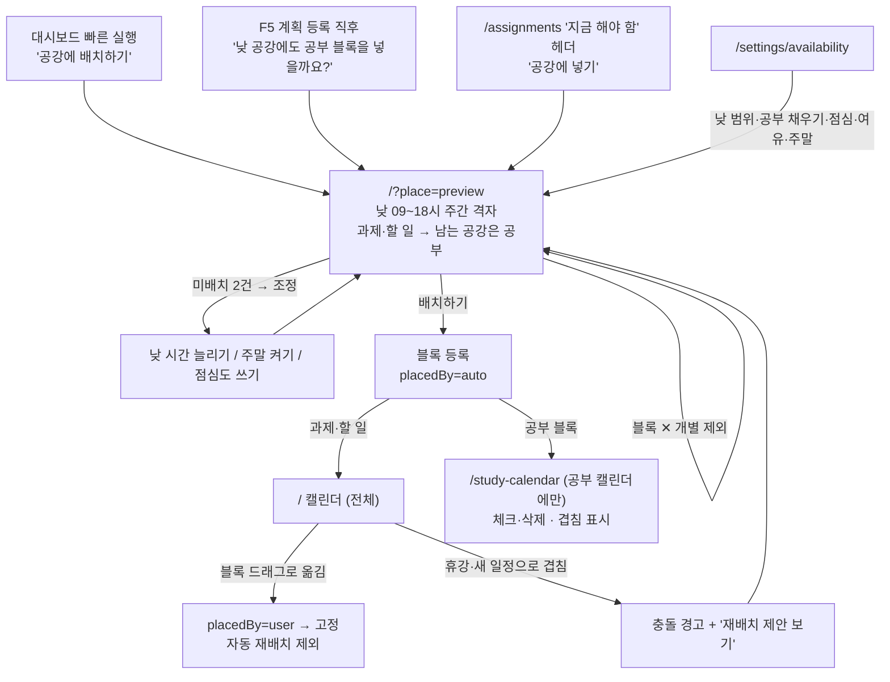

### 13-2. 라우트·파라미터

| 경로 | 화면 |
|---|---|
| `/?place=preview` | 배치 미리보기 (전체 화면 모달) |
| `/settings/availability` | 가용 시간 설정 |

| 파라미터 | 값 | 히스토리 |
|---|---|---|
| `place` | `preview` | `push` (뒤로가기로 닫힘) |
| `range` | `7` `14` — 배치 대상 일수 (기본 7) | `replace` |

> F8 은 **기능 전용 페이지를 만들지 않는다.** 공통 규칙 7번("캘린더는 하나뿐")에 따라, 배치 결과가 사는 곳은 `/` 의 캘린더다.

### 13-3. 배치 미리보기 (주간 격자)

> 2026-10-07 개정 — 배치 범위는 **낮 09:00~18:00** 뿐이다(저녁 19~24시는 F5 시험 공부 계획 몫).
> 과제(F7 순서)·할 일(C1)을 먼저 넣고, **남는 공강은 공부 블록**(남은 진도율 ÷ 시험까지 남은 날수가 큰 과목)으로 채운다.

```
┌ 공강에 배치하기   10/06~10/12 [이번 주 ▾]  낮 09:00~18:00 공강 · 남는 공강은 공부   [×] │
├────────────────────────────────────────────────────────────────────────────────────────┤
│        화      수      목      금      토      일      월                              │
│ 09  ░수업░  ▓과제▓  ░수업░  ▒공부▒                                                      │
│ 11  ▓할 일▓ ▒공부▒          ▒공부▒                                                      │
│ 13  ░수업░  ░수업░  ░수업░  ▒공부▒                    ← 연두 = 과제·할 일, 청록 = 공부  │
│ 15  ▒공부▒          ▓과제▓  ▒공부▒                                                      │
│ 17  ▒공부▒                                                                              │
├────────────────────────────────────────────────────────────────────────────────────────┤
│ 하루 합계  화 4h  수 3h  목 2h  금 7h      (상한 없음 — 표시만)                          │
│ ▸ 공부 과목 고르는 순서 — 남은 진도율 ÷ 시험까지 남은 날수                               │
├────────────────────────────────────────────────────────────────────────────────────────┤
│ ⚠ 배치하지 못함 1건                                                                     │
│   팀 프로젝트 보고서 30시간 중 22시간 — 마감까지 빈 공강이 없습니다                      │
│   [낮 시간 늘리기] [주말 켜기] [점심 시간도 쓰기]                                       │
├────────────────────────────────────────────────────────────────────────────────────────┤
│ 새 블록 14개 · 18시간 (공부 11시간)                       [다시 계산]      [배치하기]   │
└────────────────────────────────────────────────────────────────────────────────────────┘
```

| 요소 | 동작 |
|---|---|
| 격자 | 수업 = 회색, 기존 일정 = 파랑, **새 과제·할 일 = 연두(`#4D7C0F`)**, **새 공부 = 청록**, 이미 있는 블록 = 점선. 색만으로 구분하지 않게 블록에 `시각 · 종류`와 이름을 쓴다 |
| 블록 호버·포커스 | 근거 툴팁 — `남은 진도 85% · 시험 D-12 · 공강 60분` · `9/29 할 일 · 공강 60분` |
| 블록 `✕` | 그 블록만 빼고 즉시 재계산 — 나머지 배치는 그대로. 과제·할 일을 뺀 시간은 미배치(`미리보기에서 뺐습니다`)로, 공부 블록은 그냥 빈다 |
| 하루 합계 | 날짜별 합계만 (툴팁에 공부 시간) — 하루 상한은 2026-10-06 사용자 요청으로 없앴다 |
| 공부 과목 순서 | 접힘 목록 — 과목 · 남은 진도 % · D-n (오늘 기준 점수 순). 과목 이름을 누르면 `/exams?exam=` |
| 조정 버튼 | 누르면 설정을 바꾸고 바로 다시 계산(설정 화면으로 나가지 않는다) |
| `배치하기` | 등록 후 토스트 `12개 블록을 캘린더에 넣었습니다` + `캘린더에서 보기` |

### 13-4. 캘린더에서의 표시와 보호

| 상황 | 화면 |
|---|---|
| 자동 배치 블록 | **과제·할 일 블록만 전체 캘린더(`/`)에** — `자동` 칩 + 연두 배경, 상세에 종류와 근거 한 줄 |
| 공부 블록 | **전체 캘린더에 넣지 않는다 — 공부 캘린더(`/study-calendar`)에만** `공강` 표시로 (2026-10-07, F5 의 '공부 계획은 공부 캘린더에만'과 같은 규칙 — 두 캘린더는 따로다). 체크·삭제는 거기서, 겹침·시험 지남은 블록에 `⚠ …` 한 줄 |
| 사용자가 드래그로 옮김 | 칩이 사라지고 **고정**. 이후 재배치에서 제외된다(토스트: `이 블록은 이제 고정됩니다`) |
| 충돌 발생 | 겹친 블록에 ⚠ + 상단 배너 `수업이 바뀌어 3개 블록이 겹칩니다` + `재배치 제안 보기` |
| 완료 체크 | 흐리게 + 취소선, 재배치 대상에서 제외 |
| 일괄 삭제 | 설정에서 `자동 배치 블록 지우기`(기간 지정) — 고정·완료 블록은 남긴다 |

### 13-5. `/settings/availability`

2026-10-07 — 하루를 둘로 나눠 쓴다. 한 페이지에 두 구역.

| 구역 | 항목 | 기본값 |
|---|---|---|
| **낮 — 공강 배치 (F8)** | 배치 범위 | 09:00 ~ 18:00 (07:00 ~ 19:00 안에서) |
| | 남는 공강에 공부 블록 | 켬 |
| | 점심 제외 | 12:00 ~ 13:00 (끌 수 있음) |
| | 주말 사용 | **끔** (켜면 토·일 낮도 같은 규칙) |
| | 수업 앞뒤 여유 | 10분 |
| | 블록 길이 | 최소 30분 · 최대 2시간 |
| | 배치 기간 | 7일 (7 · 14) |
| **저녁 — 시험 공부 계획 (F5)** | 저녁 시간대 | 19:00 ~ 24:00 (17:00 이후 시작) — 계획 분량이 공부 캘린더에 차례로 놓인다 |
| | ~~하루 상한~~ | **없음** (2026-10-06 F8 · 2026-10-07 F5 — '없음'으로만 표시) |
| 공통 | 자동 배치 블록 지우기 | 기간 지정 — 고정·완료 블록은 남긴다 |

~~수업 사이 공강 사용~~ — 2026-10-07 삭제(낮 범위 안은 전부 공강).

### 13-6. 컴포넌트·API

```
components/dashboard/PlacementPreview.tsx   주간 격자(분 단위 위치) + 하루 합계 + 공부 과목 순서 + 미배치·조정 제안
lib/placement.ts                            서버 응답 타입 · TASK_LABEL
components/pages/SettingsPages.tsx          AvailabilitySettings — 낮은 F8, 저녁은 F5(/api/exams/settings {evening}) 서버 저장
F5_Test_agent/web/study_calendar.html       공부 캘린더 — 공강 공부(kind='gap') 체크·삭제는 F8 API
app/settings/availability/page.tsx
```

| 시점 | 호출 |
|---|---|
| 미리보기 | `POST /api/placement/preview` `{range, exclude?, settings?}` → `{blocks(taskType), unplaced, dailyTotals, studyTargets, studyMinutes, …}` |
| 등록 | `POST /api/placement` `{signature, at, range?, exclude?}` → 학습 블록 생성(`placedBy: auto`). 미리보기와 결과가 다르면 409 |
| 충돌 검사 | `/api/events` 의 학습 블록 `extendedProps.conflict` (캘린더가 받을 때 같이) · 목록은 `GET /api/placement/conflicts` |
| 옮기기·완료 | `PATCH /api/placement/blocks/{pb:n}` `{start, end}`(→ 고정) · `{done}` · `{fixed: false}` |
| 재배치 제안 | `POST /api/placement/preview` 그대로 — 자동 배치분 전체를 다시 계산한다(고정·완료 블록은 그대로) |
| 일괄 삭제 | `DELETE /api/placement?from=&to=` (고정·완료 제외) |
| 설정 | `GET/PUT·PATCH /api/settings/availability` (`null` = 그 칸 기본값, `{reset: true}`) · 저녁은 F5 `GET·PUT /api/exams/settings {evening}` |

> **미리보기와 등록을 나눈다** — F5 와 같은 규칙이다. 계산은 부수효과가 없고, 캘린더를 바꾸는 것은 `배치하기` 뿐이다.

### 13-7. 로딩·빈·에러

| 상황 | 화면 |
|---|---|
| 시간표 없음 | `공강을 계산하려면 시간표가 필요합니다` + `/attendance?tab=timetable` |
| 배치할 작업 없음 | `지금 배치할 공부·과제가 없습니다` |
| 전부 미배치 | 격자 대신 미배치 목록과 조정 제안만 |
| 이미 배치됨 | 미리보기 상단 `이미 배치된 블록 12개 — 자동 배치분만 다시 계산합니다` |
| 계산 실패 | 토스트 + 미리보기 유지 |

### 13-8. 반응형

| 폭 | 미리보기 |
|---|---|
| ≥ 1280px | 7일 격자 전체 |
| 768~1279px | 5일(평일)만 보이고 좌우 스크롤 |
| < 768px | 격자 대신 **날짜별 목록**(시간·블록·근거) |

---

---

## 14. F9 — 자연어 일정 등록·질의

요구사항은 [요구사항정의서.md](요구사항정의서.md) F9 절. 메뉴를 없앤 허브 구조(3절)에서 **대화가 빠른 이동 수단 역할**까지 겸한다.

### 14-1. 화면 흐름도

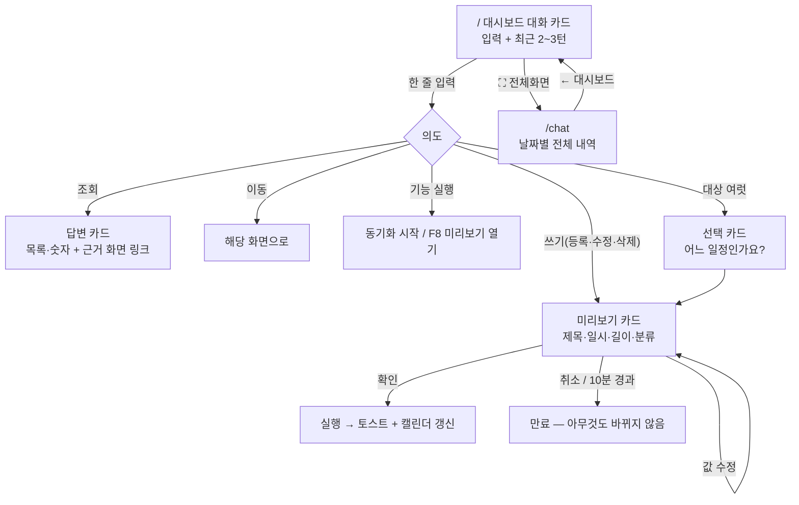

### 14-2. 라우트·파라미터

| 경로 | 화면 |
|---|---|
| `/` 대화 카드 | 입력 + 최근 대화 (액션 패널 아래) |
| `/chat` | 전체 대화 내역 |

| 파라미터 | 값 | 히스토리 |
|---|---|---|
| `q` | `/chat?q=…` — 외부에서 질문을 실어 보낼 때 | `push` |

> 대화 카드는 **모달이 아니다.** 대시보드에 늘 떠 있고, 길게 볼 때만 `/chat` 으로 간다.

### 14-3. 대시보드 대화 카드

```
┌ 💬 무엇이든 물어보세요                                        [⛶]       │
│ ─────────────────────────────────────────────────────────────────────── │
│ 나: 이번 주 마감 뭐 남았어?                                              │
│ 유니버스: 3건 있습니다                                                   │
│    · 퀴즈 2회        오늘 23:59   컴퓨터네트워크                         │
│    · 3주차 실습      내일 23:59   운영체제                               │
│    · 품질 보고서     9/28 18:00   소프트웨어공학론                       │
│    [과제 목록 열기 →]                                                    │
│ ─────────────────────────────────────────────────────────────────────── │
│ [ 다음 주 목요일 발표 리허설 저녁 8시              ]              [보내기]│
└─────────────────────────────────────────────────────────────────────────┘
```

| 요소 | 동작 |
|---|---|
| 입력창 | Enter 전송, Shift+Enter 줄바꿈 |
| 최근 대화 | 2~3턴만. 넘치면 위가 잘리고 `⛶` 로 전체 보기 |
| `⛶ 전체화면` | `/chat` (`push`) |
| 답변 카드 | 목록·숫자 + **근거 화면 링크** — 숫자를 화면에서 확인할 수 있어야 한다 |
| 빈 상태 | 예시 3개를 버튼처럼 눌러 바로 실행 |

### 14-4. 미리보기 카드 — 쓰기의 마지막 방어선

```
┌ 이렇게 등록할까요? ─────────────────────────────────────────┐
│ 제목    발표 리허설                                          │
│ 일시    2026-10-02(목) 20:00 ~ 22:00                        │
│ 분류    개인 ▾                                               │
│ ⚠ 겹치는 일정 1건 — 팀 회의 20:00~21:00                      │
│                                        [취소]  [확인]        │
└──────────────────────────────────────────────────────────────┘
```

| 규칙 | 내용 |
|---|---|
| 확인 전 | **아무것도 바뀌지 않는다.** 서버는 `PendingAction` 만 만든다 |
| 값 수정 | 카드 안에서 직접 고친다 — 날짜만 틀렸을 때 다시 말하지 않아도 된다 |
| 애매한 값 | 물음표 + 노랑 테두리 (예: 오전/오후 불명) |
| 겹침 | 경고만 하고 막지 않는다 |
| 여러 건 | 카드를 **건별로** 쌓고 각각 확인 |
| 만료 | 10분 뒤 카드가 흐려지고 `다시 말씀해 주세요` |
| 거절 | e클래스 마감·학사일정·수업 수정 요청은 카드 대신 거절 문구 |

### 14-5. `/chat` 전체 화면

| 요소 | 동작 |
|---|---|
| 상단 | `← 대시보드` + `대화 지우기` |
| 본문 | 날짜 구분선이 있는 전체 내역. 미리보기 카드의 결과(확인/취소)도 기록으로 남는다 |
| 하단 | 같은 입력창 |
| 실행 기록 | `e클래스 동기화를 시작했습니다` 같은 실행 결과도 대화에 남는다 |

### 14-6. 컴포넌트·API

```
components/chat/
  ChatCard.tsx        대시보드용 (입력 + 최근 턴)
  ChatThread.tsx      /chat 전체 내역
  PreviewCard.tsx     쓰기 미리보기(값 수정 포함)
  AnswerCard.tsx      목록·숫자 + 근거 링크
  PickTargetCard.tsx  대상 선택
app/chat/page.tsx     (신규)
```

| 시점 | 호출 |
|---|---|
| 전송 | `POST /api/chat` `{text}` → `{reply, cards[], pendingAction?}` |
| 확인 | `POST /api/chat/actions/{id}/confirm` → 실제 실행 + 결과 |
| 취소 | `POST /api/chat/actions/{id}/cancel` |
| 내역 | `GET /api/chat/messages?before=` |
| 삭제 | `DELETE /api/chat/messages` |

> **쓰기 도구는 `/api/chat` 에서 실행되지 않는다.** 미리보기 객체만 만들고, 실제 변경은 `confirm` 에서만 일어난다(F9-R40).

### 14-7. 로딩·빈·에러

| 상황 | 화면 |
|---|---|
| 처리 중 | 점 세 개 + `취소` |
| 해석 실패 | `무슨 뜻인지 모르겠습니다` + 예시 3개 |
| LLM 미설정 | 입력창 잠금 + `분석 서비스가 설정되지 않았습니다` (다른 화면은 정상) |
| 동의 전 | F4 와 같은 동의 모달을 먼저 |
| 실행 실패 | 대화에 실패 메시지 + `다시 시도` |

### 14-8. 반응형

| 폭 | 대화 카드 |
|---|---|
| ≥ 1280px | 액션 패널 아래 고정 |
| 768~1279px | 캘린더 아래 전체 폭 |
| < 768px | 하단 고정 입력 바 + 탭하면 전체 화면(`/chat`) |

---

---

## 15. F10 — 아침 브리핑

요구사항은 [요구사항정의서.md](요구사항정의서.md) F10 절. **새 계산이 없다** — 앞 기능들이 만든 값을 모아 대시보드 맨 위에 카드 하나로 놓는 것이 전부다.

### 15-1. 화면 흐름도

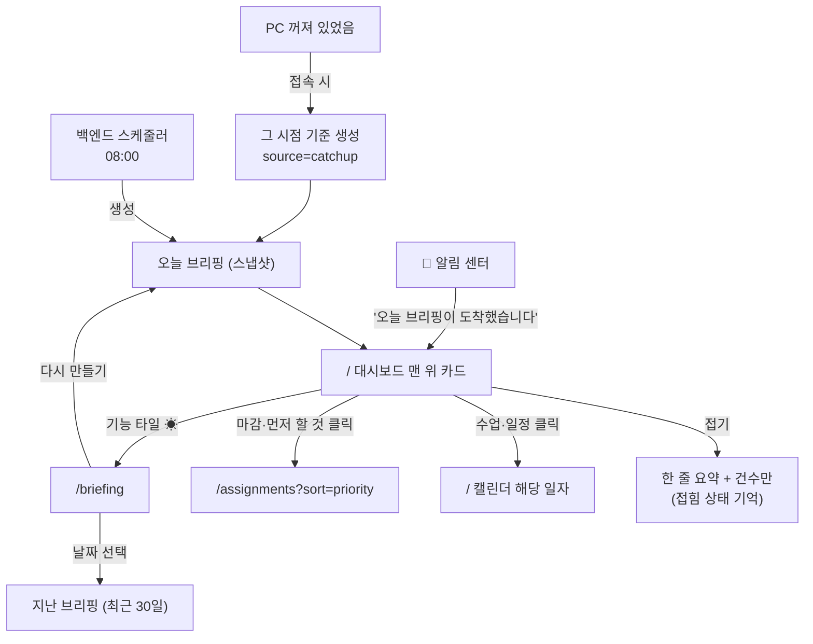

### 15-2. 라우트·파라미터

| 경로 | 화면 |
|---|---|
| `/` 상단 카드 | 오늘 브리핑 |
| `/briefing` | 지난 브리핑 목록 + 본문 |

| 파라미터 | 값 | 히스토리 |
|---|---|---|
| `date` | `/briefing?date=2026-09-20` | `replace` |

### 15-3. 대시보드 브리핑 카드

**위치는 커버 아래·3단 위.** 캘린더를 밀어내므로 접기가 필수다.

```
┌ ☀ 9월 26일 금요일 브리핑                   07:00 생성      [접기 ▲] │
│ 오늘은 과제 2건이 급합니다.                              ← LLM 한 줄 │
│ 📚 수업 3   09:00 운영체제 · 13:00 소프트웨어공학론 · 15:00 …        │
│ 📅 일정 2   11:00 학습 블록(운영체제 15쪽) · 19:00 스터디            │
│ ⏰ 마감 3   오늘 퀴즈 2회 · 내일 3주차 실습 · 9/28 품질 보고서       │
│ 🔥 먼저 할 것  1) 퀴즈 2회  2) 3주차 실습  3) 품질 보고서            │
└──────────────────────────────────────────────────────────────────────┘

접힌 상태
┌ ☀ 브리핑 · 수업 3 · 마감 3                              [펼치기 ▼] │
└──────────────────────────────────────────────────────────────────────┘
```

| 요소 | 동작 |
|---|---|
| 접기/펼치기 | 상태를 `localStorage` 에 기억. **기본은 펼침** |
| 놓친 브리핑 | 제목 옆에 `놓친 브리핑 · 08:00 예정 → 10:24 생성` 칩 |
| 섹션 항목 | 클릭 → 캘린더 또는 과제 목록. 섹션당 최대 5줄, 넘으면 `+2건 더` |
| 한 줄 요약 없음 | LLM 실패 시 **그 줄만 빠진다**(오류 문구를 띄우지 않는다) |
| 08:00 이전 | 카드를 아예 띄우지 않는다 |

### 15-4. `/briefing`

| 요소 | 동작 |
|---|---|
| 왼쪽 | 날짜 목록(최근 30일). 놓친 브리핑은 칩으로 구분 |
| 오른쪽 | 그날 브리핑 전체(스냅샷 — 이후 데이터가 바뀌어도 그대로) |
| 상단 | `← 대시보드` · `다시 만들기`(오늘 것만) |
| < 768px | 목록 → 본문 2단계 이동 |

### 15-5. 설정 — `/settings/notifications`

F1·F6 의 알림 시점과 F10 브리핑을 **한 화면에서** 관리한다.

| 항목 | 기본값 |
|---|---|
| 브리핑 시각 | 08:00 (끄기 가능) |
| 브리핑 보관 기간 | 30일 |
| 알림 기본 시각 | 09:00 |
| 학사일정 알림 | D-7 / D-3 / D-1 |
| 과제 마감 알림 | D-3 / D-1 / 당일 아침 |

> 모바일 알림 설정은 없다(전역 결정 G2). 채널 선택 UI 를 만들지 않는다.

### 15-6. 컴포넌트·API

```
components/briefing/
  BriefingCard.tsx     대시보드 카드(접기 포함)
  BriefingSections.tsx 섹션 4종 렌더링(공용)
app/briefing/page.tsx  (신규) 날짜 목록 + 본문
app/settings/notifications/page.tsx (신규)
```

| 시점 | 호출 |
|---|---|
| 대시보드 진입 | `GET /api/briefing/today` — 없으면 서버가 `catchup` 으로 만들어 반환 |
| 지난 목록 | `GET /api/briefings?limit=30` |
| 특정 날짜 | `GET /api/briefings/{date}` |
| 다시 만들기 | `POST /api/briefing/regenerate` |
| 설정 | `GET/PUT /api/settings/notifications` |

> **생성은 서버가 한다.** 프론트는 만들어진 스냅샷을 보여 줄 뿐이고, 카드가 직접 데이터를 모아 계산하지 않는다(숫자가 두 벌이 되는 것을 막는다).

### 15-7. 로딩·빈·에러

| 상황 | 화면 |
|---|---|
| 생성 전(08:00 이전) | 카드 없음 |
| 생성 중 | 카드 자리 스켈레톤 |
| 데이터 없음 | `오늘은 일정이 없습니다` 한 줄 |
| 브리핑 꺼짐 | 카드 없음. 기능 타일은 `/briefing` 으로 |
| 불러오기 실패 | 카드만 `브리핑을 불러오지 못했습니다` + `다시 시도` (대시보드 나머지는 정상) |

---

---

## 16. F11 — 장학 공지 매칭·신청서 자동 작성

요구사항은 [요구사항정의서.md](요구사항정의서.md) F11 절. 이 프로젝트에서 **돈이 걸린 유일한 화면**이다. 판정 근거와 "제출은 본인이 한다"는 사실이 화면에서 한순간도 흐려지면 안 된다.

### 16-1. 화면 흐름도

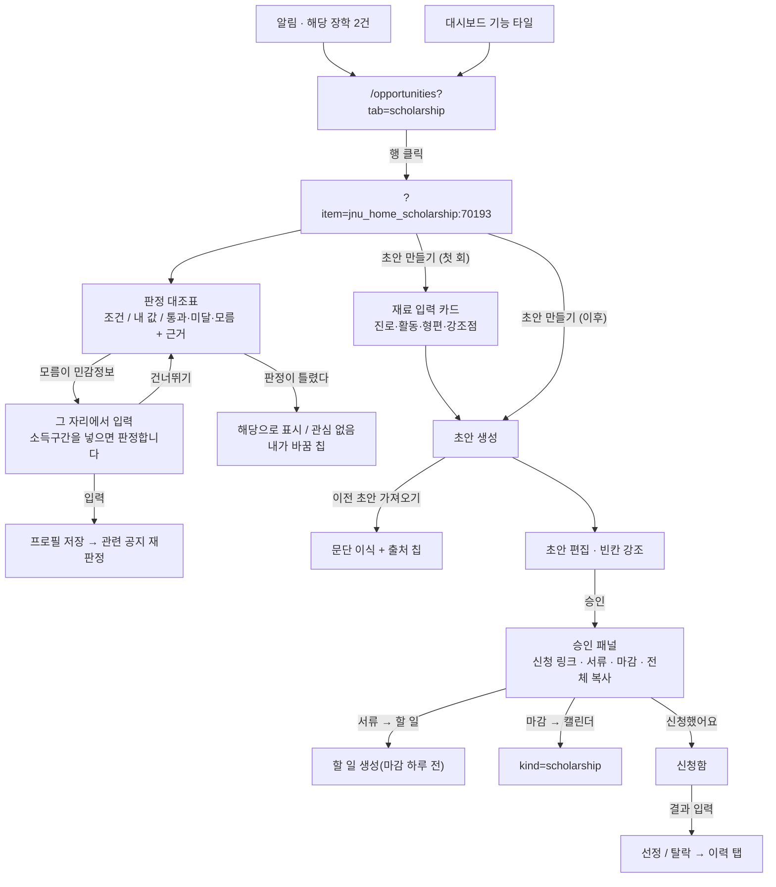

### 16-2. 라우트·파라미터

| 경로 | 화면 |
|---|---|
| `/opportunities` | **장학·대외활동·사업단·이력**을 탭으로 (F11·F12·F13 공유) |

| 파라미터 | 값 | 기본값 | 히스토리 |
|---|---|---|---|
| `tab` | `scholarship` `activity` `program` `history` | `scholarship` | `replace` |
| `item` | 공지 id (`jnu_home_scholarship:70193`) — 상세 패널 | — | `push` |
| `view` | `match` `draft` `apply` — 상세 안 단계 | `match` | `replace` |
| `show` | `all` — 비해당·마감까지 펼치기 | 접힘 | `replace` |

> F12·F13 은 **탭만 늘린다.** 목록·상세·판정 구조를 그대로 쓴다.

### 16-3. 목록

```
┌ 🎁 기회                          [장학] [대외활동] [사업단] [이력]        │
│                                        수집: 오늘 06:00 · 카탈로그 9/21   │
├───────────────────────────────────────────────────────────────────────────┤
│ 🟢 해당 2                                                                 │
│  두을장학재단 제29기        두을장학재단   300만원   D-5   [초안 대기]     │
│  AI융합대학 성적우수장학     AI융합대학    150만원   D-12                  │
│ 🟡 확인 필요 3                                                            │
│  국가근로장학 2학기          한국장학재단  —        D-3   소득구간 모름    │
├───────────────────────────────────────────────────────────────────────────┤
│ + 비해당·마감 12건 더보기 ▾                                               │
└───────────────────────────────────────────────────────────────────────────┘
```

| 요소 | 동작 |
|---|---|
| 판정 배지 | `해당`(초록) `확인 필요`(노랑) `비해당`(회색) `마감`(회색 취소선) — **글자 병기** |
| 진행 칩 | `초안 대기` `승인` `신청함` `선정` `탈락` — 있을 때만 |
| 확인 필요 사유 | 행 오른쪽에 `소득구간 모름` 처럼 **무엇 때문인지** 한 마디 |
| 접기 | 비해당·마감은 기본 접힘(`?show=all` 로 펼침) |
| 수집 상태 | 헤더 오른쪽. 카탈로그는 별도 날짜 표시(주 1회) |

### 16-4. 상세 — 판정 대조표 (`view=match`)

```
┌ 두을장학재단 제29기 두을장학생                          [해당] [원문 ↗] │
│ 두을장학재단 · 300만원 · 신청 ~2026-10-02(목)  D-5                       │
├───────────────────────────────────────────────────────────────────────────┤
│ 조건            내 값        판정      근거                              │
│ 학년 2~3학년     3학년        충족     "3학년 이상 재학생" (공고문 1쪽)   │
│ 평점 3.0 이상    3.42/4.5     충족     "직전학기 평점 3.0 이상"          │
│ 이수 12학점 이상 18학점       충족     "직전학기 12학점 이상"            │
│ 소득구간 8 이하  —            모름     "학자금 지원 8구간 이하"           │
│   └ 소득구간을 넣으면 판정해 드립니다. 이 조건 확인에만 씁니다.           │
│     [8구간 ▾] [저장]  [건너뛰기]                                         │
├───────────────────────────────────────────────────────────────────────────┤
│ 기타 조건  "타 장학금과 중복 수혜 불가" (자동 판정하지 않음)              │
│                              [관심 없음]  [해당으로 표시]  [초안 만들기]  │
└───────────────────────────────────────────────────────────────────────────┘
```

| 요소 | 동작 |
|---|---|
| 대조표 | **조건 / 내 값 / 판정 / 근거** 4열. 근거는 원문 인용 + 쪽수, 클릭하면 원문 링크 |
| 모름 + 민감정보 | 그 행 아래 **인라인 입력**. 저장하면 프로필에 들어가고 관련 공지가 모두 재판정된다 |
| 기타 조건 | 구조화 못 한 조건을 **원문 그대로**. "자동 판정하지 않음" 명시 |
| `해당으로 표시` | 판정을 뒤집는다 → `내가 바꿈` 칩 + 되돌리기. 미달 항목이 있으면 초안 상단에 경고 |
| `관심 없음` | 숨김. 이력 탭에서 되돌릴 수 있다 |

### 16-5. 상세 — 초안 (`view=draft`)

**첫 초안일 때만** 재료 입력 카드가 먼저 뜬다.

```
┌ 처음이니 한 번만 알려 주세요 ─────────────────────────────┐
│ 진로 목표   [임베디드 AI 분야 대학원 진학            ]     │
│ 활동 경험   [교내 AI 경진대회 참가, 학과 튜터링 2학기 ]     │
│ 가정 형편   [                              ] (선택)       │
│ 강조할 점   [                              ] (선택)       │
│ ⓘ 여기 적은 내용만 근거로 씁니다. 없는 사실은 지어내지 않습니다.
│ ⓘ 다음 장학부터는 이걸 다시 씁니다. 언제든 고칠 수 있어요.  │
│                                     [초안 만들기]         │
└───────────────────────────────────────────────────────────┘
```

초안 화면:

| 요소 | 동작 |
|---|---|
| 본문 | 7단 구성(기본 정보·자격 정리·지원 동기·학업 계획·제출 서류·신청 방법·확인 사항)을 **그 자리에서 편집** |
| 빈칸 | `{{…}}` 을 노랑 배경으로 강조 + `채워야 할 곳 3` 카운터 |
| 출처 칩 | 이전 초안에서 가져온 문단에 `○○장학에서 가져옴` |
| `이전 초안 가져오기` | 비슷한 장학 목록 → 문단 선택 이식 |
| 생성 방식 | 하단에 `LLM 작성 · 프롬프트 v1` 또는 `템플릿만(LLM 미설정)` |
| 이름·학번 | `{{이름}}` `{{학번}}` 그대로 — **채우지 않는다** |

### 16-6. 승인·제출 패널 (`view=apply`)

```
┌ 제출 준비 ────────────────────────────────────────────────┐
│ ⚠ 제출은 시스템이 하지 않습니다. 확인 후 본인이 직접 제출하세요.
│ 신청 방법  학사정보시스템 → 장학 → 신청           [바로가기 ↗]
│ 마감       2026-10-02(목) 18:00                  [캘린더에 넣기]
│ 제출 서류                                                  │
│   ☐ 재학증명서              [할 일로 보내기]               │
│   ☐ 성적증명서              [할 일로 보내기]               │
│   ☐ 신청서(초안 사용)                                      │
│                       [초안 전체 복사]  [신청했어요]        │
└───────────────────────────────────────────────────────────┘
```

| 요소 | 동작 |
|---|---|
| 고정 고지 | 패널 맨 위에 항상. 스크롤해도 보인다 |
| `캘린더에 넣기` | `kind: scholarship` 일정 생성(승인 시 자동으로도 생성) |
| `할 일로 보내기` | 마감 **하루 전** 기한의 할 일 생성 |
| `초안 전체 복사` | 클립보드 복사 + 토스트 `복사했습니다` |
| `신청했어요` | 진행 상태 → `신청함`. 이후 `선정` / `탈락` 버튼이 나온다 |

### 16-7. 이력 탭

| 요소 | 내용 |
|---|---|
| 요약 | 학기별 `신청 5 · 선정 2 · 450만원` |
| 목록 | 상태별(신청함·선정·탈락·관심 없음) 정렬 |
| 되돌리기 | `관심 없음` 을 다시 목록으로 |

### 16-8. 컴포넌트·API

```
app/opportunities/page.tsx        (신규) 탭 4개 + 목록 + 상세 패널
components/opportunities/
  NoticeList.tsx        판정 배지·진행 칩·접기
  MatchTable.tsx        조건 대조표(근거·인라인 민감정보 입력)
  DraftEditor.tsx       초안 편집·빈칸 강조·출처 칩
  MaterialForm.tsx      재료 1회 입력
  ApplyPanel.tsx        승인·서류·복사·상태 전이
  HistoryPanel.tsx      이력
```

| 시점 | 호출 |
|---|---|
| 목록 | `GET /api/opportunities?tab=scholarship&show=` |
| 상세 | `GET /api/opportunities/{id}` — 공지·요건·판정·근거·초안 상태 |
| 민감정보 입력 | `PATCH /api/profile` → 응답에 **재판정된 결과** 포함 |
| 판정 뒤집기 | `PUT /api/opportunities/{id}/verdict` `{verdict, reason}` |
| 재료 | `GET/PUT /api/draft-material` |
| 초안 생성 | `POST /api/drafts` `{noticeId, borrowFrom?}` |
| 초안 수정 | `PATCH /api/drafts/{id}` `{markdown}` |
| 승인·반려 | `POST /api/drafts/{id}/approve` · `/reject` |
| 상태 전이 | `PATCH /api/applications/{id}` `{state, amount?}` |
| 서류 → 할 일 | `POST /api/events` (`isTodo: true`) |
| 수집 | `POST /api/sources/notice/sync` · `POST /api/sources/hakstd-catalog/sync`(SSO) |

### 16-9. 로딩·빈·에러

| 상황 | 화면 |
|---|---|
| 프로필 없음 | `학년·학과를 넣으면 나에게 맞는 장학을 골라 드립니다` + `/onboarding` |
| 해당 0건 | `지금 해당하는 장학이 없습니다` + 확인 필요 건수 |
| 이미지 공지 | `본문이 이미지라 자동 판정하지 못했습니다` + 원문 링크 |
| LLM 없음 | 초안 자리에 `문단 자동 작성은 설정 후 가능합니다`, 체크리스트·신청 방법은 정상 |
| 카탈로그 미수집 | `교내 상시 장학은 로그인이 필요합니다` + `지금 가져오기` |
| 원문 변경 | 초안 상단 `원문이 바뀌었습니다 — 다시 만들기` |

### 16-10. 반응형

| 폭 | 구성 |
|---|---|
| ≥ 1280px | 왼쪽 목록 + 오른쪽 상세 2단 |
| 768~1279px | 목록 → 상세 전환 |
| < 768px | 상세는 전체 화면, 대조표는 조건마다 카드로 쌓기 |

---

---

## 17. F12 · F13 — 맞춤 기회 · 사업단 공지

요구사항은 [요구사항정의서.md](요구사항정의서.md) F12·F13 절. **새 화면이 없다** — F11 의 `/opportunities` 에 **탭 두 개와 관심사 설정**을 더하고, 게시판 관리는 `/settings/sources` 에 얹는다.

### 17-1. 화면 흐름도

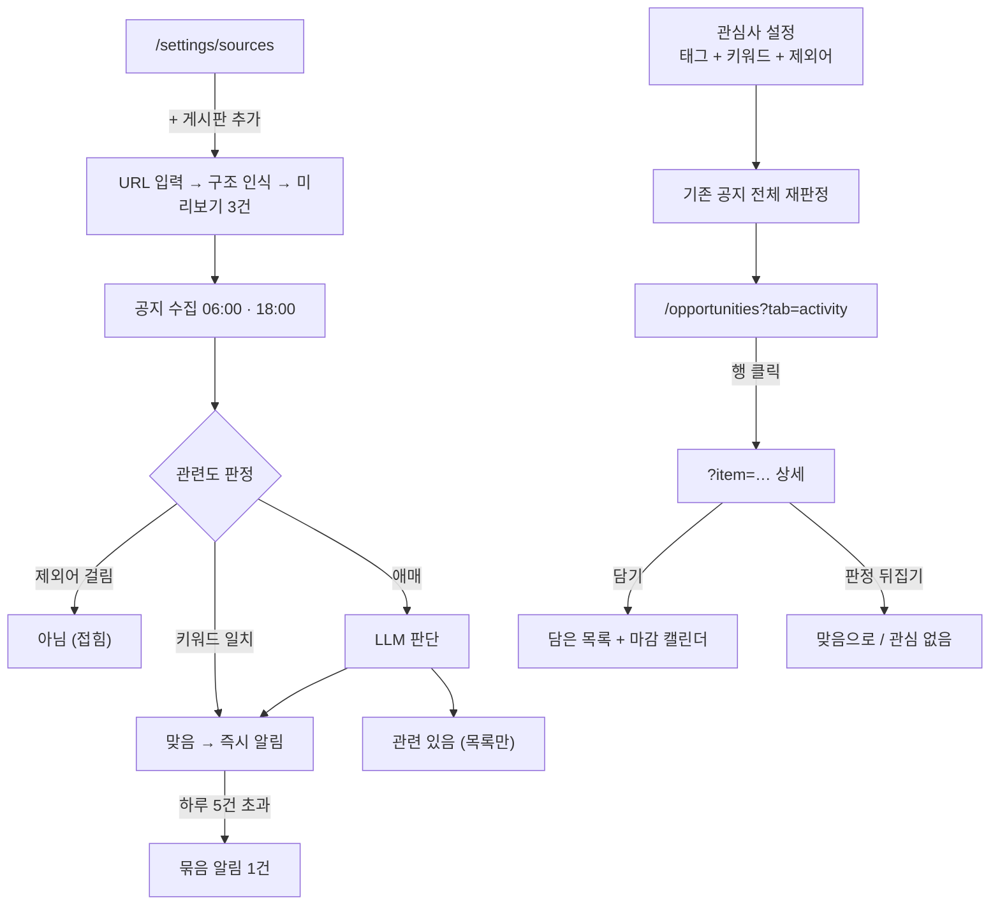

### 17-2. 탭과 파라미터 (F11 과 공유)

| 파라미터 | 값 | 비고 |
|---|---|---|
| `tab` | `scholarship` `activity` `program` `history` | `activity` = F12 대외활동 · `program` = F13 사업단 |
| `item` | 공지 id | 상세 패널 (F11 과 같은 컴포넌트) |
| `show` | `all` | `아님` 등급까지 펼치기 |
| `saved` | `1` | 담아 둔 것만 보기 |

### 17-3. 목록 — 등급과 이유

```
┌ 🎁 기회                          [장학] [대외활동] [사업단] [이력]        │
│                                              [관심사 설정] [담은 것만]    │
├───────────────────────────────────────────────────────────────────────────┤
│ 🟢 맞음 3                                                                 │
│  2026 AI 아이디어 경진대회     AICOSS사업단   D-9   [AI·SW] ["공모전"]     │
│  SW 해커톤 참가자 모집          정보전산원     D-4   [AI·SW]               │
│ 🔵 관련 있음 5                                                            │
│  창의융합 캠프 수강생 모집      교육혁신본부   D-12  LLM 판단              │
├───────────────────────────────────────────────────────────────────────────┤
│ + 아님 24건 더보기 ▾                                                      │
└───────────────────────────────────────────────────────────────────────────┘
```

| 요소 | 동작 |
|---|---|
| 등급 | `맞음`(초록) `관련 있음`(파랑) `아님`(회색, 접힘) — **글자 병기** |
| **이유 칩** | 걸린 관심사 태그와 키워드를 그대로 — `[AI·SW] ["공모전"]`. LLM 판정이면 `LLM 판단` |
| 행 정보 | 제목 · 주관 · 대상 · 마감 D-day · 출처 게시판 |
| `담은 것만` | `?saved=1` |
| 접기 | `아님` 은 기본 접힘(`?show=all`) |

> **이유 칩이 이 화면의 핵심이다.** 왜 왔는지 보이지 않으면 관심사를 고칠 방법이 없다.

### 17-4. 관심사 설정

```
┌ 관심사 설정 ──────────────────────────────────────────────┐
│ 태그  [AI·SW ✓] [공모전·경진대회 ✓] [해외연수] [창업]      │
│       [인턴·채용 ✓] [봉사] [자격증·교육] [연구·학회]       │
│       [문화·예술] [체육]                                   │
│ 키워드  [반도체 ✕] [공정실습 ✕] [+ 추가]         (최대 20) │
│ 제외    [대학원생 ✕] [+ 추가]                              │
│ ⓘ 바꾸면 기존 공지를 다시 분류합니다.                       │
│                                        [저장]              │
└───────────────────────────────────────────────────────────┘
```

| 요소 | 동작 |
|---|---|
| 태그 | 토글. 10개 기본 제공 |
| 키워드 | 칩 추가·삭제. 1글자는 거부 |
| 제외 | 걸리면 무조건 `아님` |
| 저장 | **전체 재판정** → 목록 즉시 갱신, 토스트 `32건을 다시 분류했습니다` |
| 너무 넓은 키워드 | 저장 후 `"학생"에 오늘 32건이 걸렸습니다` 안내 |

### 17-5. 게시판 관리 — `/settings/sources`

e클래스·학사일정과 **같은 화면**에 공지 게시판 목록을 둔다.

```
공지 게시판 (F11·F12·F13)                        [+ 게시판 추가]
  ✓ 전남대 홈페이지 › 장학안내      기본   06:00 · 12건
  ✓ AICOSS 사업단                   기본   06:00 · 3건
  ✓ 인공지능학부 공지                기본   06:00 · 5건
  ✓ 우리 학과 산학협력단             내 추가 06:00 · 실패  [다시 시도]
                                            [사용 중지] [삭제]
```

| 요소 | 동작 |
|---|---|
| `+ 게시판 추가` | URL 입력 → **구조 인식 시도** → 성공하면 최근 글 3건 미리보기 → 저장 |
| 인식 실패 | `게시판 목록을 찾지 못했습니다` — 저장하지 않는다 |
| 로그인 필요 | `공개 게시판만 지원합니다` |
| 기본 게시판 | 삭제 불가, 사용 중지만 가능 |
| 실패 표시 | 그 행만 빨강 + 사유. 다른 게시판 수집은 계속된다 |

### 17-6. 알림

| 상황 | 동작 |
|---|---|
| `맞음` 새 공지 | 즉시 알림 1건 — 제목 + 걸린 관심사 |
| 하루 5건 초과 | 이후는 묶음 1건 `관심 기회 7건이 더 있습니다` → 목록으로 |
| 담아 둔 것 마감 D-3 | 알림 1건 |
| `관련 있음` | 알림 없음(목록에만) |
| 관심사 미설정 | **알림을 보내지 않는다** |

### 17-7. 컴포넌트·API

```
components/opportunities/
  InterestSettings.tsx   태그·키워드·제외어 + 재판정
  GradeBadge.tsx         맞음/관련 있음/아님 + 이유 칩
  BoardManager.tsx       게시판 목록·추가·미리보기 (/settings/sources 안)
```

| 시점 | 호출 |
|---|---|
| 목록 | `GET /api/opportunities?tab=activity&show=&saved=` |
| 관심사 | `GET/PUT /api/interests` → 응답에 재판정 결과 수 |
| 담기 | `POST /api/bookmarks` · `DELETE /api/bookmarks/{id}` |
| 판정 뒤집기 | `PUT /api/opportunities/{id}/grade` `{grade}` |
| 게시판 목록 | `GET /api/boards` · `POST /api/boards`(미리보기 포함) · `PATCH`/`DELETE` |
| 수집 | `POST /api/sources/notice/sync` (F11 과 공용) |

### 17-8. 로딩·빈·에러

| 상황 | 화면 |
|---|---|
| 관심사 미설정 | 상단 안내 카드 + 태그 고르기. 목록은 최신순으로 전부 |
| 맞음 0건 | `지금 관심사에 맞는 기회가 없습니다` + 관련 있음 건수 |
| 게시판 추가 실패 | 모달 안에서 사유 표시, 저장 안 함 |
| 수집 실패 | 해당 게시판만 표시, 목록은 이전 데이터 유지 |
| LLM 없음 | `키워드로만 고르고 있습니다` 한 줄 |

---

---

## 18. F16 — 팀플 일정 조율

요구사항은 [요구사항정의서.md](요구사항정의서.md) F16 절. **서버가 필요한 첫 화면**이다(전역 결정 G5). 그래서 이 화면만 "인터넷이 없으면 안 되는" 예외를 갖는다 — 나머지 화면은 그대로 동작해야 한다.

### 18-1. 화면 흐름도

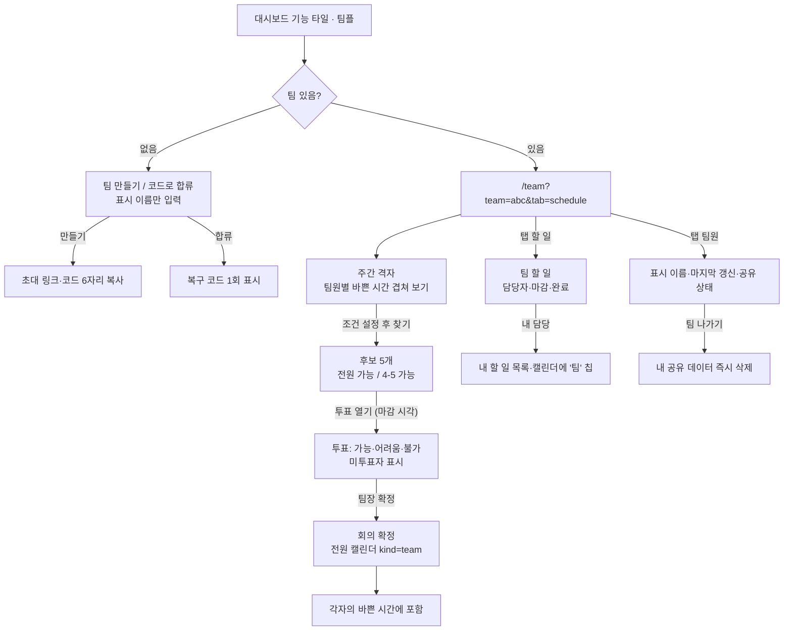

### 18-2. 라우트·파라미터

| 경로 | 화면 |
|---|---|
| `/team` | 팀 선택기 + 일정 조율 / 할 일 / 팀원 탭 |

| 파라미터 | 값 | 기본값 | 히스토리 |
|---|---|---|---|
| `team` | 팀 id | 마지막으로 본 팀 | `replace` |
| `tab` | `schedule` `tasks` `members` | `schedule` | `replace` |
| `poll` | 투표 id — 투표 패널 | — | `push` |
| `join` | 초대 코드 — 링크로 들어왔을 때 | — | `push` |

> 초대 링크는 `/team?join=ABC123` 형태다. 앱이 없으면 안내 페이지가 뜬다(⏳ 서버 구축 때 결정).

### 18-3. 공유 고지 — 화면 상단 고정

```
┌───────────────────────────────────────────────────────────────────────────┐
│ ⓘ 공유되는 것: 바쁜 시간대(시각만) · 표시 이름 · 팀 할 일                 │
│    공유되지 않는 것: 일정 제목 · 과목명 · 성적 · 이름 · 학번               │
└───────────────────────────────────────────────────────────────────────────┘
```

이 줄은 **접히지 않는다.** 남의 데이터를 다루는 화면에서 무엇이 오가는지는 늘 보여야 한다.

### 18-4. 일정 조율 탭

```
┌ 캡스톤 5조                                    [팀 선택 ▾] [초대 링크 복사] │
│ [일정 조율] [할 일] [팀원 5]                                              │
├───────────────────────────────────────────────────────────────────────────┤
│ 조건  길이 [1시간 ▾]  기간 [다음 7일 ▾]  시간대 [평일 09~22시 ▾] [찾기]   │
├───────────────────────────────────────────────────────────────────────────┤
│        월    화    수    목    금                                          │
│ 09    ▓▓▓  ▓▓▓        ▓▓▓        ← 진한 칸 = 누군가 바쁨(사람 수만큼 진함) │
│ 11    ▓▓   ░░░   ░░░   ░░░   ▓▓   ← 옅은 칸 = 대부분 비어 있음             │
│ 14    ░░░  ▓▓▓  ░░░   ⭐    ░░░   ← ⭐ 후보                               │
│ 19    ░░░  ░░░  ░░░   ░░░   ░░░                                           │
├───────────────────────────────────────────────────────────────────────────┤
│ 후보                                                                       │
│  ⭐ 10/2(목) 14:00~15:00   전원 가능              [투표 열기]             │
│     10/1(수) 11:00~12:00   4/5 — 민준 불가                                │
│     10/3(금) 19:00~20:00   3/5 · 2명 정보 없음                            │
└───────────────────────────────────────────────────────────────────────────┘
```

| 요소 | 동작 |
|---|---|
| 격자 | 팀원 수만큼 진해지는 **히트맵**. 개별 이름은 칸에 쓰지 않는다(제목도 없다) |
| 후보 카드 | `전원 가능` / `4/5 — 민준 불가` / `3/5 · 2명 정보 없음` — **정보 없음을 가능으로 세지 않는다** |
| `투표 열기` | 후보 여러 개를 골라 투표 생성 + 마감 시각 설정 |
| 조건 변경 | 즉시 재계산(서버 호출) |
| 후보 0개 | `전원 가능한 시간이 없습니다` + 조건 완화 버튼 3개(길이·기간·시간대) |

### 18-5. 투표 패널 (`?poll=`)

```
┌ 회의 시간 투표 · 내일 18:00 마감 ─────────────────────────┐
│           10/2(목) 14:00   10/1(수) 11:00   10/3(금) 19:00 │
│ 나         [가능]▼          어려움           불가          │
│ ─────────────────────────────────────────────────────────  │
│ 지훈       가능             가능             불가          │
│ 서연       가능             어려움           가능          │
│ 민준       —                —                —      ← 미투표│
│ 하람       가능             불가             어려움        │
│ ─────────────────────────────────────────────────────────  │
│ 점수        7               3                4             │
│ 2명 미투표 — 민준, (나)                     [확정] (팀장)  │
└───────────────────────────────────────────────────────────┘
```

| 요소 | 동작 |
|---|---|
| 내 행 | 드롭다운으로 `가능 / 어려움 / 불가` 선택, 즉시 저장 |
| 미투표자 | 이름을 그대로 표시(`—`). 마감 임박 시 알림 |
| 점수 | 가능 2 · 어려움 1 · 불가 0 합계 |
| `확정` | 팀장만. `불가` 가 있는 후보를 고르면 한 번 더 확인 |
| 확정 후 | 전원 캘린더에 `kind: team` 일정 + 알림, 투표 닫힘 |

### 18-6. 할 일 탭

| 요소 | 동작 |
|---|---|
| 목록 | 제목 · 담당자(아바타 이니셜) · 마감 D-day · 완료 체크 |
| 추가 | 제목 · 담당자(복수) · 마감 · 메모 |
| 내 담당 | `나` 칩으로 강조, **내 할 일 목록·캘린더에도** 나타난다 |
| 진행 | 상단에 `12건 중 7건 완료` + 사람별 막대 |
| 지난 마감 | 빨강 + 담당자 이름 |
| 완료 기록 | `지훈이 9/26 완료` |

### 18-7. 팀원 탭

| 요소 | 동작 |
|---|---|
| 목록 | 표시 이름 · 역할(팀장/팀원) · **마지막 갱신**(`2시간 전`) · 공유 상태 |
| `정보 오래됨` | 24시간 초과면 배지. 교집합 정확도 경고와 연결 |
| 팀장 기능 | 초대 코드 재발급 · 팀장 위임 · 팀 삭제 |
| 내 기능 | `공유 일시 중지` · `팀 나가기`(내 데이터 삭제 안내) · `복구 코드 재발급` |

### 18-8. 컴포넌트·API

```
app/team/page.tsx               (신규) 팀 선택기 + 탭 3개
components/team/
  ShareNotice.tsx     공유 고지 고정 줄
  BusyHeatmap.tsx     주간 격자 히트맵
  CandidateList.tsx   후보 카드
  PollPanel.tsx       투표 표
  TeamTasks.tsx       팀 할 일
  MemberList.tsx      팀원·갱신 상태
```

| 시점 | 호출 (**서버**) |
|---|---|
| 팀 목록·합류 | `GET /api/teams` · `POST /api/teams` · `POST /api/teams/join` `{code, displayName}` |
| 바쁜 시간 업로드 | `PUT /api/teams/{id}/busy` `[{start,end}]` — **제목 없음**, 로컬이 1시간마다 |
| 교집합 | `POST /api/teams/{id}/slots` `{duration, range, hours}` → 후보 |
| 투표 | `POST /api/teams/{id}/polls` · `PUT /api/polls/{id}/vote` · `POST /api/polls/{id}/confirm` |
| 회의 | `GET /api/teams/{id}/meetings` → 로컬이 받아 캘린더에 반영 |
| 할 일 | `GET/POST/PATCH /api/teams/{id}/tasks` |
| 탈퇴·삭제 | `DELETE /api/teams/{id}/members/me` · `DELETE /api/teams/{id}` |

> 로컬 앱이 **서버의 회의·팀 할 일을 내려받아** 캘린더·할 일에 합친다. 서버가 캘린더를 직접 쓰지 않는다.

### 18-9. 로딩·빈·에러

| 상황 | 화면 |
|---|---|
| 팀 없음 | `팀을 만들거나 초대 코드로 합류하세요` + 두 버튼 |
| 팀원 1명 | `팀원을 초대하면 시간을 맞춰 드립니다` + 초대 링크 복사 |
| **서버 연결 실패** | 팀 화면만 `팀 기능은 인터넷 연결이 필요합니다` + `다시 시도`. **다른 화면은 정상** |
| 정보 오래된 팀원 | 격자 위 `2명의 정보가 오래되어 정확하지 않을 수 있습니다` |
| 후보 0개 | 조건 완화 버튼 3개 |
| 초대 코드 오류 | `코드를 다시 확인해 주세요` |

### 18-10. 반응형

| 폭 | 구성 |
|---|---|
| ≥ 1280px | 격자 + 후보 목록 2단 |
| 768~1279px | 격자 위 · 후보 아래 |
| < 768px | 격자 대신 **날짜별 후보 목록**, 투표는 후보 하나씩 카드로 |

---

## 19. 공통 라우팅 규칙 (모든 기능에 적용)

1. **라우트는 기능 단위 명사 하나.** 상세·탭·필터는 쿼리 파라미터로.
2. **모달 = 쿼리 파라미터 + `push`.** 그래야 뒤로가기로 닫히고, 링크로 공유·딥링크된다.
3. **탭·필터 = `replace`.** 히스토리를 어지럽히지 않는다.
4. **목록 → 상세 → 뒤로** 했을 때 목록의 스크롤 위치와 탭이 유지된다.
5. **알림·브리핑에서 오는 링크는 항상 "상세 모달이 열린 URL"** 이다. 새 화면을 따로 만들지 않는다.
6. **한 화면의 실패가 다른 화면을 막지 않는다.** 패널 단위로 에러를 가둔다.
7. **캘린더는 하나뿐이다.** 기능 페이지(`/academic` 등)는 목록·승인 화면이고, 일정을 그리는 화면은 `/` 의 캘린더뿐이다. 기능마다 작은 캘린더를 또 만들지 않는다.
8. **외부 서비스로 나가는 연동 화면은 없다.** 외부 캘린더 연동·OAuth 동의·내보내기 버튼을 넣지 않는다(전역 결정 G1). 외부로 향하는 링크는 학교 공지 원문처럼 **읽으러 가는 링크**뿐이다.
9. **알림은 PC 화면 안에서 끝난다.** 헤더 팝오버 + 놓친 알림이 전부이고, 모바일 푸시 관련 화면(권한 요청, 구독 관리)은 추후 검토 전까지 만들지 않는다(G2).
10. 새 라우트를 추가하면 이 문서 2-1 표와 **대시보드 기능 타일**(3절)을 같이 고친다. 헤더에는 메뉴를 늘리지 않는다.

---

## 20. 구현 체크리스트

### C1 서비스 캘린더

- [ ] 뷰 4종(월·주·목록·학기)과 `?view=` 연결, `localStorage` 복원
- [ ] 학기 뷰 — 좌우 패널 접고 전체 폭 전환
- [ ] 소스별 클릭 → `?event=` 상세 라우팅(5종)
- [ ] 반복 일정: 수업 자동 생성 + 사용자 반복 규칙 + `이 일정만/이후 전체` 확인 모달
- [ ] 드래그 이동·크기 조절의 낙관적 업데이트와 실패 롤백, 잠긴 소스 안내 토스트
- [ ] 키보드 단축키(T/←→/M·W·L·S/N/Esc/?)와 입력창 예외

### C2 프로필·온보딩

- [ ] 학과 마스터 수집기 — 교육과정검색 GET 크롤링 → `departments.json`(61개 단과대)
- [ ] `/onboarding` 3단계(`?step=`)와 첫 실행 감지·건너뛰기
- [ ] 검색형 학과 선택기(`단과대 › 학과 › 전공` 경로 표시)
- [ ] `/settings/profile` 3구역(기본/성적·학점/장학용) + 민감 구역 접힘·`전부 지우기`
- [ ] `자동`/`수정함` 칩 — 학사시스템 자동 채움과 사용자 수정 구분
- [ ] 프로필 저장 시 F1·F2 데이터 무효화(5-4 표)와 룰셋 재매칭 토스트

### F1 학사 일정

- [ ] `next.config.ts` 에 `trailingSlash: true` 추가 후 `npm run build` → `out/academic/index.html` 생성 확인
- [ ] `layout.tsx` 에 Header · Toast · Notification 컨텍스트 배치
- [ ] `/academic` 페이지 + 탭 4개 + 월 그룹 목록
- [ ] 상세 모달을 `?event=` 로 여닫는 훅(`useQueryState`) — `/` 와 공용
- [ ] 확인 필요 카드(날짜 인라인 수정 + 승인/거절 + 되돌리기 토스트)
- [ ] 캘린더에 `kind="academic"` 렌더링(유형별 색·아이콘·기간 막대)
- [ ] 원천별 동기화 버튼과 상태 표시(진행 중 비활성·실패 사유)
- [ ] 알림 팝오버(놓친 알림 구분·읽음 처리)
- [ ] 프로필 화면과 미입력 배너
- [ ] 폰 375px 에서 목록·모달(바텀 시트) 확인

### F2 졸업요건

- [ ] `/graduation` 탭 3종(`?tab=summary|courses|whatif`)과 `?track=` 이수유형 전환
- [ ] 요약 — 진행률 도넛·남은 학점·판정 배지·**고정 고지 문구**
- [ ] 영역별 막대 → `?area=` 포함 과목 모달
- [ ] 졸업인증 체크리스트(3상태: 충족/미충족/모름)와 메모 즉시 저장
- [ ] 이수 과목 표 — 구분 드롭다운 인라인 수정, `?filter=unmapped`, 수기 과목 추가 모달
- [ ] 미분류 배너 → 판정 배지를 `확인 필요`로 내리는 연동
- [ ] 가정 계산 탭 — 현재/가정 후 나란히, `POST /simulate` 로만 계산(프론트에 규칙 복제 금지)
- [ ] `/settings/requirements` 룰셋 편집 + 근거 표시 + `기본값으로 되돌리기` + 교과구분 매핑
- [ ] SSO 세션 만료 모달, 룰셋 없음 안내 카드
- [ ] 메인 대시보드 기능 섹션에 졸업요건 요약 타일

### F3 출결

- [x] 시간표 **자동 가져오기**(학사정보시스템 조회 → 학수번호+분반 매칭 → `강의시간` 파싱) + 못 찾은 과목만 수기 입력
- [x] 저장 시 **회차 자동 생성**(개강~종강 × 요일 − 공휴일 + 학교 지정 보강일) + 생성 결과 토스트
- [x] 과목별 현황 카드 — 막대·상태 배지(글자 병기)·**근거 줄**·누적 직접 수정
- [x] 회차 목록 인라인 상태 칩(출석/결석/지각/조퇴/공결) + 휴강·보강
- [x] 이번 주 탭 — 요일별 몰아서 입력, `모두 출석으로` + 지난 주 미입력 모음
- [x] C1 `class` 일정과 **같은 데이터** 사용(캘린더 주·목록 보기에서도 출결 체크)
- [x] 상태 상승 시 1회 알림 + 위험 문구에 남은 여유 숫자
- [x] 지난 미입력 배너, 공식 기록 아님 고지
- [x] 교시 ↔ 시각 대응표(학교 시간표 모듈 기본, 수정·되돌리기) · 개강·종강·휴업일 직접 입력 · 학사경고 안내
- [x] (2026-09-29) 날짜(회) 단위 계산 · 칩 5개(출석·결석·지각·공결·휴강, 조퇴 없음) · 학사일정·e클래스 공지 자동 휴강 + 근거 표시 · 공지 '확인 필요'

### F4 강의자료·RAG

- [ ] `/courses` 목록 + 과목 상세 탭 4종(`?course=`, `?tab=`)
- [ ] 첫 사용 **동의 모달** — 동의 전 인덱싱·생성 잠금
- [ ] 자료 탭 — 드래그 앤 드롭 업로드, 파일별 인덱싱 상태(색+글자), e클래스 수집분 삭제 잠금
- [ ] **`CitationChip` 공용 컴포넌트** — 요약·문제·답변이 모두 같은 `[p.12]` 를 쓴다
- [ ] 원문 뷰어(`?file=&page=`) + 인용 하이라이트, ≥1280px 나란히 보기
- [ ] 요약 탭 — 범위 필터(`?range=`), 생성 중 스켈레톤, `모델 · 프롬프트 v1 · 날짜` 표기
- [ ] 문제 탭 — 만들기 모달, 목록 접힘, **풀기 모드 전체 화면**(숫자키·Enter), 결과·오답 다시 풀기
- [ ] 질문 탭 — 근거 카드, `자료에서 찾지 못했습니다` 처리
- [ ] 생성 실패·근거 부족·API 한도를 패널 단위로 가두기

### F5 시험 공부 일정

- [x] `/exams` 목록 + 우측 패널 3단계(`?exam=&step=options|preview|progress`) · 좁은 화면은 시트
- [x] 공지 추출 시험의 **확인 필요 카드**(근거 원문 인용 + 공지 링크 + `맞아요` 승인 · 수정은 모달)
- [x] 옵션 — 범위 주차 칩(F4 쪽수 자동 채움)·쪽/분 단위·난이도·하루 상한·제외일 칩·마무리 복습일·예상 문제
- [x] **미리보기 표** — 날짜별 쪽수·시간·합계, 상한 초과 빨강 띠 + 조정안(넘친 곳에 맞는 것만, 상한 올리기는 늘 마지막)
- [x] 여러 과목 겹침 경고(날짜별 누적 시간 — 이 계획 + 다른 과목 = 합계)
- [x] `등록하기` → 학습 블록(`kind=study`) 생성, 토스트 + `캘린더에서 보기`
- [x] 진도 막대·밀림 배너·`재조정`(미리보기 재확인 후 적용, 자동 변경 금지)
- [x] 캘린더 학습 블록 상세 — 그날 볼 자료(F4 링크) + 완료 체크 · 시험 상세(근거 원문)
- [x] 대시보드 타일 `오늘 공부: N쪽` (확인 필요·밀림이 있으면 그것부터)
- [x] 과목별 시험(중간·기말 유무) 모달 `?setup=courses` · 임의 일정 점선 표시·안내 · 지우기 확인 문구 (2026-10-01)
- [x] 계획 옵션: **학습일 수**가 주 옵션 + 미니 달력에서 날짜 직접 고르기(바꿀 때마다 미리보기를 조용히 다시 받는다) · 분량은 쪽수만 (2026-10-01)
- [x] 공부 캘린더 `/study-calendar` (F5_Test_agent/web — 과목·시간·분량, 날짜 선택·완료 체크, 좁은 화면은 목록) · 시험 헤더의 `공부 캘린더` 버튼
- [x] 전체 캘린더에는 날짜가 확정된 시험만(임의 일정·확인 필요 제외) · 시각 미정은 수업 시간 '(수업 시간)'
- [x] 2026-10-07: 하루 4시간 경고·여러 과목 합산 경고·그 조정안·한 번 더 확인 삭제 · 저녁 시간대(19~24시)는 계획 전용 — 공부 캘린더에 차례로, F8 공강 공부도 함께
- [x] 2026-10-02: 하루 상한 옵션 삭제 · 복습 기본 1일 · 헤더 `난이도 시간 설정`(쉬움 1·보통 1.5·어려움 2분/쪽, 위아래 0.5분씩) · 공부 캘린더 체크 해제·삭제
- [x] 2026-10-02: 학습일 기본 3일 · 학습일 칸 지우고 다시 치기(비우고 떠나면 직전 값)
- [x] 2026-10-06: 카드마다 공부 진도 그래프(직접 체크 + 계획 완료, 범위 자료 대비) · `자료 체크` 모달 · 범위 없는 시험은 'e클래스 강의자료 전체' · 계획 분량 = 범위 − 체크
- [x] 2026-10-06: 계획 만들기 = ① 얼마나(분량·난이도 → **총 공부 시간**) ② 언제(학습일·달력) ③ **하루 몇 시간**(날마다 시간을 직접 정한다 — 손대지 않은 날이 남은 시간을 나눠 가짐, 예산 막대·슬라이더·`h:mm` 칸·±30분, 모자라면 등록 불가 + 한 번에 고치기) · 미리보기 표에 `직접` 칩 · 하루 분량/시간은 범위로
- [x] 2026-10-06: 이름 **시험·발표**(타일·제목·추가 버튼) · **발표 카드는 `준비 완료` 버튼만**(범위·진도 그래프·자료 체크·계획 만들기 없음, `PATCH /api/exams/{id}/ready`) · 추가 폼에서 발표면 범위 칸 숨김 · 공부 캘린더 발표 줄 ✓
- [ ] 학습 블록을 캘린더에서 **드래그**해 옮기기는 붙였지만(같은 날에 합침) 손으로 더 써 봐야 한다

### F6 과제 마감

- [ ] `/assignments` 목록 + 탭(`?tab=open|done|past`) + 과목 필터
- [ ] 상세 모달을 캘린더와 **공용**(`?event=dl:…`) — `EventDetail` 확장
- [ ] D-day·유형(과제/퀴즈/동영상) 칩, `변경됨` 칩과 이전 마감 취소선
- [ ] **`내가 체크함`** — 점선 체크 + 문구로 e클래스 `제출 완료`와 구분, 자동 승격
- [ ] `SyncStatusBar` 공용 컴포넌트 — 정상/재시도/로그인 필요/연속 실패 4상태
- [ ] **동기화 버튼 상태 공유** — 여러 화면의 버튼이 `/api/status` 하나를 보고 함께 비활성(`already_running`·`source` 구분, 3초/1분 폴링)
- [ ] `/settings/sources` e클래스 행 — 주기 선택, 최근 실행 이력(시각·결과·소요·건수)
- [ ] `로그인 창 열기` 버튼(로컬 Playwright 창)
- [ ] 놓친 주기 `catchup` 이력 표시

### F7 과제 우선순위

- [ ] `?sort=priority|due|course` — 기본 `급한 순`, 그룹 헤더로 묶기
- [ ] 그룹 헤더 — 건수 + `지금 해야 함` 합계 시간 + **오늘 남은 시간 막대**(초과 시 빨강)
- [ ] **이유 한 줄** — 모든 행에 `마감 8시간 전 · 3시간 필요`
- [ ] `EstimatePicker` 인라인 소요시간 수정 → 즉시 재계산, `직접 입력` 칩
- [ ] `나중에` 그룹 기본 접힘, `마감 없음` 그룹 분리
- [ ] 대시보드 상위 3건 카드 → 상세 모달은 F6 과 공용
- [ ] 순위는 **저장하지 않고 조회 시 계산**(1분 폴링으로 갱신)

### F8 공강 배치

> 2026-10-06 구현 (`F8_Plan_agent/`) — 화면은 서버 값을 그대로 그린다.

- [x] 진입점 3곳(대시보드 빠른 실행 · F5 등록 직후 · F7 그룹 헤더)에서 `/?place=preview`
- [x] **주간 격자 미리보기** — 수업/기존 일정/새 블록 3레이어, 블록에 이름 표기
- [x] 블록 근거 툴팁 + `✕` 개별 제외 후 재계산
- [x] 하루 합계 (상한 없음 — 2026-10-06)
- [x] **미배치 목록 + 조정 버튼**(저녁·주말·점심) — 누르면 설정을 저장하고 화면을 떠나지 않고 재계산
- [x] 등록 시 `placedBy: auto` · `자동` 칩, 사용자가 옮기면 **고정**(칩 제거 + 토스트)
- [x] 충돌 감지 배너 → `재배치 제안 보기`(자동 변경 금지)
- [x] `/settings/availability` — 서버 저장, 하루 상한 없음 · 낮(F8)/저녁(F5) 두 구역 (2026-10-07)
- [x] 남는 공강 → 공부 블록, 공부 과목 순서 목록, 공부 캘린더에 공강 공부 (2026-10-07)
- [x] < 768px 에서는 격자 대신 날짜별 목록

### F9 자연어 대화

- [ ] 대시보드 **대화 카드**(입력 + 최근 2~3턴 + `⛶`) — 모달이 아니라 상주
- [ ] `/chat` 전체 내역 + `← 대시보드` + 대화 지우기
- [ ] **`PreviewCard`** — 확인 전에는 아무것도 바뀌지 않음, 카드 안에서 값 수정, 애매한 값 물음표
- [ ] 대상 선택 카드(수정·삭제 후보 다수)
- [ ] 답변 카드에 **근거 화면 링크** 필수
- [ ] 거절 문구 — e클래스 마감·학사일정·수업은 수정 불가
- [ ] `navigate` 도구로 화면 이동(메뉴 대체), `open_placement` 는 F8 미리보기를 연다
- [ ] LLM 미설정·동의 전 잠금 처리

### F10 아침 브리핑

- [ ] 대시보드 **브리핑 카드**(커버 아래·3단 위) + 접기 상태 기억
- [ ] `놓친 브리핑` 칩(예정 시각 → 실제 생성 시각)
- [ ] 섹션 4종(수업·일정·마감·먼저 할 것), 섹션당 5줄 + `+N건 더`
- [ ] LLM 한 줄 실패 시 **그 줄만 생략**(오류 문구 금지)
- [ ] 항목 클릭 → 캘린더·과제 목록으로
- [ ] `/briefing` 날짜 목록 + 스냅샷 본문 + `다시 만들기`
- [ ] `/settings/notifications` — 브리핑 시각·보관, 알림 기본 시각·시점(모바일 채널 UI 없음)
- [ ] 프론트는 **계산하지 않는다** — `GET /api/briefing/today` 스냅샷만 렌더

### F11 장학 매칭·초안

- [ ] `/opportunities` 탭 4개(`?tab=`) — F12·F13 은 탭만 추가
- [ ] 목록 — 해당·확인 필요 먼저, 비해당·마감 접기(`?show=all`), 확인 필요 사유 한 마디
- [ ] **판정 대조표** — 조건/내 값/판정/근거 4열 + 원문 인용·링크
- [ ] **민감정보 인라인 요청** — 그 행에서 입력 → 저장 → 관련 공지 재판정, `건너뛰기` 가능
- [ ] 판정 뒤집기(`해당으로 표시`/`관심 없음`) + `내가 바꿈` 칩 + 되돌리기
- [ ] **재료 1회 입력 카드**(첫 초안) → 이후 재사용, 언제든 수정
- [ ] 초안 편집기 — 빈칸 강조·카운터, `이전 초안 가져오기` + 출처 칩
- [ ] **승인 패널** — 고정 고지(제출은 본인이) · 신청 링크 · 서류 체크리스트 · **전체 복사**
- [ ] 서류 → 할 일(마감 하루 전), 마감 → 캘린더(`kind=scholarship`)
- [ ] 상태 전이 `신청했어요` → `선정`/`탈락`, 이력 탭 요약
- [ ] 이름·학번은 어디에도 채우지 않는다(자리표시자 유지)

### F12·F13 기회·사업단 공지

- [ ] `/opportunities` 에 탭 2개 추가(`?tab=activity|program`) — 목록·상세는 F11 컴포넌트 재사용
- [ ] 등급 배지(맞음/관련 있음/아님) + **이유 칩**(걸린 태그·키워드, LLM 판단 표시)
- [ ] `아님` 접기(`?show=all`), `담은 것만`(`?saved=1`)
- [ ] **관심사 설정** — 태그 10개 토글 + 키워드(최대 20, 1글자 거부) + 제외어, 저장 시 전체 재판정 토스트
- [ ] 너무 넓은 키워드 안내(`"학생"에 32건이 걸렸습니다`)
- [ ] `/settings/sources` 게시판 관리 — 기본/내 추가 구분, URL 추가 시 **구조 인식 + 미리보기 3건**
- [ ] 기본 게시판은 삭제 불가·사용 중지만, 실패는 그 행만 빨강
- [ ] 알림 — `맞음`만 즉시, **하루 5건 초과 시 묶음 1건**, 관심사 미설정이면 알림 없음
- [ ] 담기 → 마감 캘린더 등록, 이력 탭에서 상태 남기기

### F16 팀플 조율

- [ ] `/team` 팀 선택기 + 탭 3개(`?team=&tab=schedule|tasks|members`)
- [ ] 팀 만들기·합류(초대 링크 `?join=코드`, 표시 이름만) + **복구 코드 1회 표시**
- [ ] **공유 고지 고정 줄** — 공유되는 것/안 되는 것, 접히지 않음
- [ ] 주간 **히트맵**(팀원 수만큼 진해짐, 이름·제목 표시 없음)
- [ ] 후보 카드 — `전원 가능` / `4/5 — 민준 불가` / `3/5 · 2명 정보 없음`
- [ ] 투표 표 — 3단계 값, **미투표자 이름 표시**, 마감 시각, 팀장 확정(불가 포함 시 재확인)
- [ ] 확정 → 전원 캘린더 `kind=team` + 알림, 각자의 바쁜 시간에 포함
- [ ] 팀 할 일 — 담당자·마감·완료, **내 담당은 내 할 일·캘린더에 `팀` 칩**
- [ ] 팀원 탭 — 마지막 갱신·`정보 오래됨` 배지·공유 중지·팀 나가기(데이터 삭제 안내)
- [ ] **서버 실패를 이 화면 안에 가두기** — 다른 화면은 정상 동작
